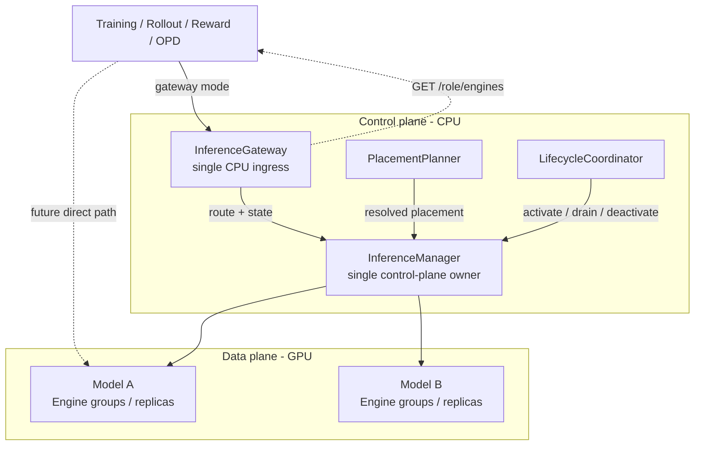
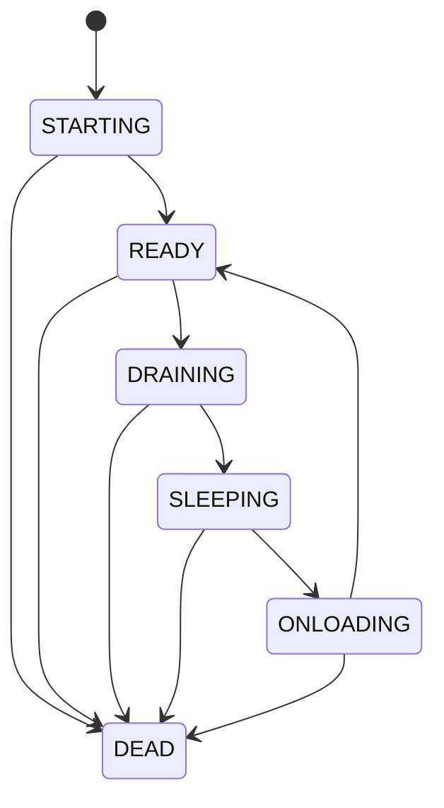
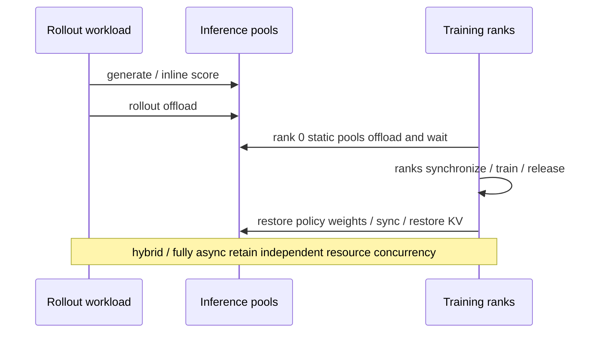

# RFC #71：统一推理服务分期实施待办

按 RFC 的 Phase 0–7 推进。每一期形成可独立评审的改动，完成验收后进入下一期；一期可以拆成多个 PR。

总体目标：统一 Rollout、GenRM、SGLang Teacher 的接口、引擎管理、资源规划与生命周期，并完成 deferred OPD 数据闭环。

我们只负责代码修改，文档更正不在我们的工作范围内。本 todolist 是经确认维护的实施设计；不新增或修改用户文档。

## 架构纠偏：Issue #71 的目标边界

当前实现把 Rollout、Teacher、GenRM 临时拆成三个控制面进程，并让三个旧类分别适配新的 Manager；这不是最终架构，不能作为后续 Phase 的基础。Issue #71 的目标是：

- 一个统一的 CPU `InferenceGateway` 类，按 role 各部署一个实例，由模型/角色路由请求；Gateway 不拥有 GPU 状态。
- 一个统一的 CPU `InferenceManager` 类，并且每个训练任务/控制域只创建一个逻辑实例，统一持有所有 role 的模型、逻辑副本、状态、准入、操作、placement ledger 和生命周期；不是全 Ray 集群单例，但不能为 Rollout、Teacher、GenRM 各创建独立 Manager 实例。
- `RolloutManager`、`TeacherManager`、`GenRMManager` 只保留为迁移期兼容入口，不能各自持有独立的模型状态、资源账本或生命周期实现；它们必须把调用转发到同一个统一控制面。
- `PlacementPlanner`、LifecycleCoordinator 和 RequestPermit 必须挂在统一控制面上；不能依赖三个 Ray Actor 进程内的 class state 互相发现资源。

因此，当前 Phase 2/3/4 中依赖“三个 role manager 分散运行”的已勾选内容全部需要返工；已有代码和测试只能作为迁移素材，不能直接作为最终验收证据。

## Phase 0：建立现状基线，确认迁移契约

目标：明确哪些行为需要保留、哪些职责需要迁移。

- [x] 记录三类角色的启动、请求、权重更新、卸载、恢复和关闭调用链。
- [x] 整理 colocate、hybrid、fully async 下的资源布局和调用时序。
- [x] 盘点现有 HTTP 接口、Ray 方法、响应结构及其调用方，包括 Autoscaler、Agentic、奖励函数和 OPD。
- [x] 整理 Model、EngineGroup、跨节点副本与 PG 所有权的现有表达。
- [x] 标出 RolloutManager 中的引擎管理职责与 workload 职责。
- [x] 整理已有测试，补充关键现有行为的特征测试。
- [x] 建立 RFC 未决事项表，并在相关阶段实施前确认：直连回退、外部 discovery 鉴权、defer 阶段顺序、弹性范围、兼容门面退役条件。
- [x] 为参数解析、Controller/Service/Launcher 改动和公开 API 删除设置单独评审节点。

验收：

- 产出三角色对照表、时序图、调用方清单、兼容清单及测试矩阵。
- 不改变运行行为。
- 后续每项迁移都能追溯到现有调用方和验证方式。

## Phase 1：统一 Discovery 与公共客户端

目标：保留现有 managers，先建立公共查询和访问契约。

- [x] 定义公共模型/副本 discovery 类型，包含角色、模型、模型级生命周期状态、准入、访问能力、权重版本和 Manager epoch。
- [x] 为三个现有 managers 增加适配，提供公共拓扑快照。
- [x] 公共 `ReplicaSnapshot` 表示完整逻辑副本，不暴露 `is_entrypoint` 或 `worker_type`；PD worker 细节留在 Manager 内部。
- [x] 接入必要的状态维护，禁止把“actor 存在”直接等同于 READY。
- [x] 在扩缩容、重启、恢复及地址变化后的查询中发布完整快照；缓存一致性使用 `manager_epoch`。
- [x] 实现无副作用的共享路由逻辑：显式 model → route_key 映射 → 默认模型 → 报错。
- [x] 首版路由统一选择 Router；不在内部路由中暴露 direct/access mode 或副本代次。
- [x] 保留旧 /rollout/engines 消费者所需兼容行为；GenRMClient 接入 v2 discovery 查询，其他旧生成路径保持兼容。
- [x] 在公共契约中保留 `allow_defer` 能力；内部路由不把 discovery 快照当作请求准入凭据。

验收：

- 三种角色可通过公共结构描述和查询。
- 模型选择、不可用副本过滤、拓扑刷新、多节点与 PD 行为有测试。
- 原有调用方保持可用；尚未迁移的生成路径继续正常工作。

## Phase 2：统一控制面与公共 CPU Gateway

目标：实现一个公共 CPU Gateway 类（每个 role 一个实例），并让三个 role 的入口使用统一的路由、协议适配和 Manager 状态契约；Gateway 是各 role 的 HTTP ingress，Manager 是引擎生命周期和资源状态的唯一所有者。

- [x] 一个 `InferenceGateway` 类分别承接 Rollout、Teacher、GenRM 的 discovery、health、模型列表、原生 generate 和聊天接口；每个 role 可部署一个实例，但不得复制 Gateway 实现和状态模型。
- [x] Gateway 使用 CPU 资源，不绑定推理 GPU PG；Controller 为每个任务创建一个 `TaskInferenceManager` handle，所有启用任务 handle 的 role Gateway、旧兼容入口和训练侧控制调用都指向该 owner。
- [x] 统一 Manager handle、epoch、snapshot、operation 和 permit 的注入方式；Gateway 的 discovery 状态只来自 owner，legacy snapshot/provider 仅保留无任务 owner 的兼容构造路径。
- [x] 复用 Phase 1 路由逻辑，统一处理显式 model、route_key、默认模型和不可用状态。
- [x] 实现统一请求代理，保留 Rollout 流式行为、GenRM messages/`{"response": ...}` 适配、Teacher/OPD 路由和连接取消。
- [x] 休眠、排空或未就绪模型拒绝推理请求；返回 503 和重试指引，不自动唤醒。
- [x] 将旧 `/rollout`、GenRM、Teacher 入口接到同一个 `InferenceGateway` 类的对应 role 实例；Gateway 实现和状态模型不按 role 复制。
- [ ] 兼容入口只保留薄适配：GenRM/Teacher 注入 task handle 时已转发至 owner；Rollout 的 workload/runtime 仍持有本地 runtime manager，待 Phase 6 EnginePool 迁移后才能勾选。

本期启动链已完成的子项：

- [x] `Controller` 为任务创建一个 CPU `TaskInferenceManager`，并向 Rollout/GenRM/Teacher Gateway 注入同一 handle。
- [x] `Service` 部署 backend 后向任务级 owner 注册 role host；OPD Teacher 单实例和 MOPD 入口也注册到同一 owner。
- [x] 三类 Gateway 的 snapshot 查询统一经任务级 owner；role host 仍仅作为迁移期运行时适配器。
- [x] 任务级 owner 持有统一 `manager_epoch` 和 request permit，并覆盖 admit/complete/cancel；permit 不再由 Gateway 或 role facade 私自维护。
- [x] 注入 task handle 时，旧 `ModelManagerFacade` 的 ready、snapshot 和 pool lifecycle RPC 经任务级 owner 转发；未注入时保留兼容直连路径。
- [x] Rollout backend 提供与 GenRM/Teacher host 一致的 `ready/call` 兼容适配，允许任务级 owner 转发模型级生命周期调用。

验收：

- 三个 role 的 Gateway 实例使用同一个 Gateway 类，并共享同一个任务级 `InferenceManager` 实例提供状态和操作。
- 旧接口兼容、流式代理、多模型路由和不可用状态响应通过测试。
- GPU 引擎卸载或重启时，Gateway 仍能提供查询服务。
- 任一旧入口与 Gateway 查询同一份 snapshot、epoch、operation 和 placement 状态。

## Phase 3：统一 Engine Pool 控制面与 SGLang 运行时契约

目标：先完成所有 role 的统一注册、快照、准入、生命周期和 preparation 控制面。Phase 3 不负责一次性重写 Rollout 的 GPU 引擎创建；真实 EnginePool 迁移拆到 Phase 6，placement 最终收敛拆到 Phase 4，兼容路径删除与硬件验收拆到 Phase 7。

- [x] 定义内部 Role/Model/EngineGroup/Replica spec，由现有配置转换，不新增统一用户配置体系。
- [x] 统一 Manager 已具备模型注册、路由配置、ModelPool、地址/快照、健康、恢复、显存操作和关闭能力；Rollout runtime 的完全迁入仍是后续未完成项。
- [x] 控制面明确逻辑副本、模型能力、权重版本和节点拓扑的边界；稳定副本身份与节点 actor 的最终绑定留到 Phase 6。
- [x] 根据 weight source、route mode 等能力在统一 Manager 中执行准入、preparation、Router 和权重证据校验；具体 DCS/引擎 RPC 迁移留到 Phase 6。
- 已移交 Phase 6：合并 GenRM 专用引擎初始化到公共 SGLangEngine 路径；不阻塞本阶段控制面收口。
- [x] 静态模型禁止注册 DCS 和参与动态策略权重更新；Teacher/GenRM 的静态权重约束已在 adapter 与统一 preparation barrier 中执行。
- 已移交 Phase 6：将 GenRM/Teacher/Rollout 的引擎逻辑迁入统一 EnginePool；Phase 3 仅完成 owner/adapter 接口。
- [x] 保留现有 Rollout 伸缩、故障恢复和权重同步的 owner 接入与状态发布路径；引擎实际迁移和全链路证明改列为 Phase 6。
- [x] 建立拓扑发布顺序：初始化、健康检查、必要权重同步、Router 更新完成后，再原子发布快照；外部 role 由 task owner 的 preparation barrier 发布，内部 role 由统一 `InferenceManager` 发布。

实现细分进度（包含 review 后结构收敛；不以 mock 测试替代硬件验收）：

- [x] 将旧 ModelConfig/EngineGroupConfig 提取为三角色公共配置，删除 model_spec_from_rollout 转换；EngineGroupSpec 仅保存组标识与副本节点拓扑，不重复并行参数或 overrides。
- [x] 实现公共模型注册、路由校验及 preparation 发布屏障，拒绝迟到的完成结果；`TaskInferenceManager` 同步暴露 operation 查询。
- [x] GenRM/Teacher 以及注入 task handle 的 Rollout 兼容入口通过同一个 owner 串行执行 health/recover/onload/offload/shutdown；Rollout workload 的本地 runtime 仍作为 Phase 6 迁移对象。
- [x] 控制面支持部分显存恢复不开放 discovery 准入且仍可清理；多节点 follower actor 的真实关闭验收改列为 Phase 7 硬件验证。
- [x] 补齐迁移素材：Teacher/GenRM 专用 Router、Teacher Gateway、即时 OPD/MOPD Gateway 路由和 GenRM messages/response 适配，保留原始地址与旧协议路径；这些 role-specific 接线不能作为公共 Gateway/Manager 最终验收。
- [x] 注入 task handle 的启动路径不再创建 `InferenceRoleManager`，直接由统一 CPU `TaskInferenceManager` 创建 role pool；旧命名 actor 仅保留无 task handle 的兼容路径，且 facade 不另存模型状态。
- 已移交 Phase 6：EngineGroupSpec 驱动运行时引擎创建；稳定副本身份及 PD Router 服务投影接入公共快照。
- 已移交 Phase 6：Rollout 专用运行时适配，保留 weights/KV 分阶段恢复、权重锁、恢复五元组和伸缩协议。
- [x] 实际初始化、健康检查、权重版本及 Router 注册结果接入 preparation 发布屏障；发现 default/缺失/不一致版本时不开放准入。真实多节点 GPU 运行验收仍单独保留。
- [x] 三类引擎池公共生命周期和兼容门面 CPU 回归已覆盖；本轮核心集合 `157 passed`，全仓 pre-commit 通过。真实多节点 follower/部分初始化及 Ray/GPU 仍需硬件验证。
- 已移交 Phase 7：真实 Ray/Router、多节点 GPU 集成验证；未提供 RAY_ADDRESS、模型与硬件配置，本阶段不以 CPU/mock 回归替代。

Phase 3 重排结论：本阶段以“统一控制面可接入并正确发布状态”为完成标准，不以“三角色已经共享同一套 GPU 引擎对象”为完成标准。Phase 3 完成后仍允许 Rollout 保留本地 runtime，但所有注入 task handle 的发现、准入、生命周期和关闭请求必须经过 task owner。

本批验证：distributed/ray、engine/inference、backends/sglang、GenRM/Gateway 与即时 OPD 路由相关 CPU 回归 618 passed。训练侧权重同步、HTTP/排空及原参数兼容补充回归 73 passed、1 skipped：现有 test_sft_train_actor_eval.py 导入已不存在的 \_should_run_sft_eval，整模块跳过，不计为 SFT 验证通过。本次改动文件的 pre-commit（含 gitleaks）及 git diff --check 通过。使用获准的本地沙箱外执行解决 Ray/psutil 读取进程及 gitleaks 缓存权限问题；不涉及远程集群。

Review 调用顺序：

本轮 review 后的结构收敛：

- [x] 复用公共 ModelConfig/EngineGroupConfig，删除 Rollout 到第二套模型配置的转换；副本拓扑单独表达。注册定义、操作去重参数及返回值深拷贝隔离调用方的可变配置。
- [x] 生命周期串行化集中到 InferenceManager，移除角色宿主重复锁；忙碌请求在兼容门面异步等待，不占满角色 RPC 线程。Rollout 本地调用保留同步等待；状态锁不跨远端 RPC，关闭/Router 清理锁仅用于清理路径。
- [ ] 三角色接入 UnifiedServiceManager 与通用 ModelPool；去掉 GenRMModelPool/TeacherModelPool 类。GenRMEngineAdapter/TeacherEngineAdapter 保留后端放置、端口、参数及旧地址接口，静态引擎状态和生命周期统一委托 MultiEngineManager；Rollout 后端保留伸缩与权重栅栏。
- [ ] 完成统一控制面下的配置、共享池、并发控制及旧调用链 CPU 回归；当前 143 项相关回归仅证明迁移素材和兼容 role view，不能作为最终架构验收。

当前调用顺序（Phase 3 控制面已实现；Phase 6/7 的运行时迁移和清理仍待完成）：

1. Phase 3 启动与发布：Rollout/Teacher/GenRM 配置适配 → 统一 InferenceManager 注册 `(role, model_id)` → 已接入的 PlacementPlanner 申请资源 → role host/ModelPool 初始化 → 健康/Router 观测 → preparation barrier/commit_observation → 各 role Gateway 实例读取统一快照。
2. Phase 3 旧控制入口：命名的 RolloutManager/TeacherManager/GenRMManager 兼容 facade → 统一 Manager handle → InferenceManager.dispatch（唯一模型操作锁）→ 当前 ModelPool 或外部 runtime adapter → 后端/节点 actor RPC。facade 不保存第二份状态；Phase 6 再移除本地 Rollout runtime。
3. 请求路径：Caller → 对应 role 的公共 Gateway 实例 → role/model 路由与 Manager permit → 对应 Router/EnginePool；生成 payload 不必经 Manager 中转，但准入、请求登记、取消和排空状态必须回到统一控制面。
4. 关闭：统一 Manager 关闭模型准入 → 等待/取消在途请求 → 关闭所有节点 actor → 释放统一 placement ledger 中的 allocation → 仅释放自有 PG。阶段协调归 Phase 5，RolloutWorkload 拆分归 Phase 6。

Phase 3 验收：

- 三类角色的引擎池和公共操作进入同一个 Manager 控制面。
- 静态模型隔离、初始化失败、重启和权重未就绪不接流量均有测试。
- 旧 manager 调用方通过兼容门面正常运行。
- Rollout 本地 runtime 可以继续存在，但注入 task handle 的 discovery、准入、生命周期和关闭操作不能绕过 task owner。

## Phase 4：统一 PlacementPlanner（依赖 Phase 2/3 控制面收口）

目标：启动引擎前完成资源分配和合法性校验。

- [x] 将分散的 GPU/bundle 偏移计算迁入统一 Manager 持有的 Planner/ledger。
- [x] 支持独立 PG 的 decoupled 和共享 Actor PG 的 split。
- [x] 校验 GPU 容量、模型并行布局、节点边界、bundle 范围及 split 重叠。
- [x] 由统一 Manager 持久记录 PG allocation，申请、幂等重试和取消都经过同一个 Planner；不能使用分散 Ray Actor 的进程内 class state。
- [x] 表达 defer 的共享资源与互斥阶段，为 Phase 5 提供计划。
- [x] 首版拒绝同一批 GPU 同一阶段的 shared co-resident 布局。
- [x] 显式记录 PG 所有权：Manager、Controller 或外部服务。
- [x] 所有 engine pool 消费解析完成的 placement，不再各自推导偏移。
- [x] 补齐启动失败、部分副本失败和关闭时的资源回滚。

验收：

- 非法布局在启动 GPU 引擎前失败。
- 有效布局与现有部署方式兼容。
- 测试证明共享/外部 PG 不会被错误删除，创建失败不会遗留自有资源。

本批进度：

- [x] 迁移子项：任务级 `TaskInferenceManager` 持有 `PlacementPlanner`，Rollout 初始布局、scale-out/scale-in 清理、GenRM 和 Teacher adapter 在注入 task handle 时通过统一 planner；无 handle 时保留兼容回退。本项是迁移接线，不是最终 placement 验收。

- [x] 将 `PlacementPlanner` 放入统一 Manager 控制面，统一解析 bundle/GPU slice、模型并行边界、节点边界、同阶段重叠和 PG owner。`PlacementPlanner` 删除全部 `ClassVar` 账本，改为实例状态；账本键改用稳定的 PG 身份（Ray PG 的 hex id），修正了"view 经 RPC 传入 owner 后 `id()` 每次不同、幂等与重叠检测全部失效"的缺陷。

- [x] Rollout、Teacher、GenRM 和 OPD 均通过统一 Manager 申请、复用、幂等重试和取消 placement；不允许各自维护独立 allocation ledger。新增 `relax/distributed/ray/placement_ledger.py` 作为唯一访问入口；`plan`/`release` 不再有 `classmethod` 旁路，`MultiEngineManager._remove_owned_pg` 也改为经 adapter 的账本释放。`create_genrm_managers`、MOPD teacher 与 multi-instance orchestrator 的启动前校验改为 `dry_run=True`，只校验不占账本。

- [x] 静态 defer 计划允许不同阶段复用同一 slice，但 activate/drain/排空由 Phase 5 Coordinator 执行。同阶段重叠拒绝、跨阶段复用允许；自动偏移只在本阶段内累加，避免 teacher 先注册时把 rollout 区域推偏。`contended_phases()` 输出 Phase 5 需要的互斥集合。

- [x] 动态副本失败时回滚 engine 与自有 PG；scale-in 不删除 Controller-owned 或 external PG，并同步释放统一 ledger 中的 allocation。`PlacementRelease.remove_placement_group` 是唯一的删除授权来源，仅 owner 为 MANAGER 且该 PG 最后一个 allocation 被释放时为真；重复释放不再二次授权。`start_rollout_servers` 启动失败时归还已预留 slice。

- [ ] 删除 role-local planner 回退入口：回退已收敛为"无 task handle 时角色自己显式持有一个 planner 实例"，不再有第二套账本实现或隐式类状态；入口本身的删除归 Phase 7。

- [ ] 真实 Ray/多节点 GPU 验收与长耗时 Scale-in 验证待提供集群、模型和硬件配置后执行；CPU 回归不替代硬件验收。

## Phase 5：生命周期协调与 Deferred Scoring

### 5A：LifecycleCoordinator 与 GenRM defer

- [x] 实现统一六态与幂等 activate/drain/deactivate/shutdown；补齐 switch_model、阶段占用与操作查询。`InferenceManager.drain/deactivate/activate/shutdown_models` 按 `operation_id` 幂等（同参复放、异参 conflict），`LifecycleCoordinator` 提供 `switch_model/transition/enter_phase/finish_phase/get_operation/get_activation_group`。

- [x] Coordinator 根据 placement 和阶段计划控制激活权限，禁止冲突角色同时占用共享 GPU。互斥关系由 placement 账本的 `contended_phases()` 推导，不手写读 args；`validate_placement` 拒绝无法把争用阶段分开的计划。

- [x] 定义并实现停止接单、在途请求处理、显存释放、加载与 READY 发布的完整顺序。固定步序 `admission_closed → drained → deactivated → release_confirmed → activation_granted → activated → ready_published`，结果只报告已确认的步，不报告尝试过的步。

- [x] 纳入权重同步、训练 ranks 同步和分阶段恢复 weights/KV cache 的现有约束。Actor 保留 gloo 屏障与 weights/KV 两段恢复；`_confirm_training_release` 以屏障为证据上报全部 ranks，未确认时 `blocked_by="training"` 绝对拒绝下一次激活。policy 模型缺权重证据时 activate 停在 `activated`，不冒充 READY。

- [x] 从 Actor、Rollout 和示例脚本迁移跨角色切换逻辑。Actor 的 `train()` 经 coordinator 释放全部 activation group；`update_weights` 在 coordinator 拥有该阶段时不再私自 onload teacher/GenRM；示例不再 `ray.get_actor("relax_genrm_manager")`。

- [x] 将 GenRM defer 整合到框架阶段，取消示例对命名 actor 的直接依赖。`post_process_rewards` 在 `scoring_phase(PHASE_GENRM)` 内调用用户 hook，框架负责排空/卸载/唤醒/回睡与释放确认。

- [x] 处理超时、取消、重复操作和阶段失败；失败时不继续激活冲突角色。drain 超时留在 DRAINING 并报 timeout，不移交资源；`finish_phase` 重复调用返回原结果；`enter_phase` 期间冲突切换返回 busy。

- [x] 取消只发起中止，不把中止当作完成：Gateway 为 native `generate` 注入 `rid`（调用方已给则不覆盖），取消时先向 Router 背后的 worker 广播 `POST /abort_request {"rid": ...}`，再让统一 Manager 把该登记标记为 aborting 并**保留**（不报告为已完成）。仅 `dispatched=False`（请求从未到达引擎）才清除登记。

  已中止的请求**不阻塞控制面 drain**，与基线 `2a8d2ed` 保持一致：断连时基线控制面完全不参与，安全性由引擎的 release 路径提供——`sglang_engine.py::release_memory_occupation` 先 `/pause_generation(mode="abort")` 停止接单并中止全部在途，再 `abort_requests` + `/flush_cache` 循环直到 200，由 `_GENRM_OFFLOAD_DRAIN_TIMEOUT_S=120s` 兜底且失败响亮。SGLang 在 scheduler 仍有 pending/running 请求时对 `/flush_cache` 返回 400，因此 **200 本身就是"无请求在跑"的确认证据**。控制面若在此二次判定，只会把客户端断连变成卡死的 activation group，而基线没有这个行为。drain 只等待仍可能自行完成的请求，被中止的在错误信息与 owner 日志中列出；`deactivate` 在释放确认后清除这些登记（引擎已报告不再占用显存），`shutdown_models` 在关闭确认后同样清除。

验收：

- GenRM defer 无需用户脚本手工控制模型切换：示例只打分，阶段切换在框架内。
- 在途请求、重复调用、阶段中断、资源互斥有针对性测试：`tests/engine/inference/test_lifecycle.py`、`tests/distributed/ray/test_lifecycle_coordination.py`。
- split、hybrid、fully async 不因新增 Coordinator 被错误串行化：无共享 slice 且无 defer 时 `create_coordinator` 返回空 epoch，不创建 coordinator；co-resident GenRM（共享 bundle 但不 defer）不进入阶段计划。

未纳入 5A（记录原因，不算完成）：

- 真实 Ray/多节点 GPU 下的阶段切换验收未执行：未提供集群、模型与硬件配置，CPU 回归不替代。
- Rollout 的 generate 阶段仍由训练路径 onload（Phase 6 迁移），5A 用 `adopt_phase` 让 coordinator 记录该占用；这是迁移期接线，不是最终架构。

### 5B：Deferred OPD 数据闭环

- [x] 实现 submit/wait/get/cancel_deferred 与批次发布契约，将 Teacher prefill 移到独立评分阶段。`relax/engine/rollout/deferred.py` 的 `DeferredExecutor` 按固定状态序执行，批间串行（无跨批流水线）；`OpdManager` 拆出 `prepare_teacher_inputs/score_teacher/score_student_at_teacher/assemble_transfer`。
- [x] 保存样本标识、Teacher 输入、路由、多模态信息和 token-selection 所需数据。`seal_batch` 在提交时封存 `sample_index/group_index/response_length/prompt_length/route_key/has_multimodal/token_selection/required_fields`，保持有效到终态。
- [x] Student 排空卸载后激活 Teacher，完成评分及结果关联。评分在 `async_scoring_phase(PHASE_TEACHER)` 内进行：先排空并卸载 generate 阶段、确认释放，再唤醒 teacher；结果按 sample 身份关联，乱序完成不影响字段。
- [x] 写回 sampled-token/top-k 等对应训练字段，验证长度、顺序、token 对齐与 mask。`validate_scored_batch` 校验存在性、顺序、重复、response_length 变化、每个必需字段的行数与 loss_mask 长度。
- [x] 对需要 Student 二次 prefill 的模式，安排明确的后续激活阶段。`student_at_teacher` 模式在 teacher 阶段结束后经 `async_activate_phase(PHASE_GENERATE)` 显式重新激活 student，再做第二遍 prefill；重新激活失败则批次失败。
- [x] 默认在评分字段完整后再提交可训练数据；同步调整队列目标、生产完成信号和训练等待条件，避免相互等待。批次在步内 staging、步末 flush 后才 `async_put`，`is_last` 随 staged 记录一起保留，队列目标与训练等待条件无需改动；colocate 下默认启用延迟评分，hybrid/fully async 默认即时。
- [x] 定义部分失败与重试策略，禁止未完成评分的样本被当作正常完整数据训练。任一 eligible 样本未评分即整批失败并抛错，不自动重放结果未知的评分请求；成功样本只保留用于诊断。
- [x] 保留现有即时 OPD 路径。未启用延迟评分、agentic resident pipeline 与专用 teacher GPU 仍走 `OpdManager.prefill` 内联路径。

验收：

- 同一批 GPU 可以串行完成 Student → Teacher → Trainer：阶段切换与释放确认已实现并有 CPU 回归；真实共享 slice 的 GPU 验收待硬件。
- 固定样本与模型权重，比较即时/延迟评分的训练字段及 OPD 计算结果：`tests/engine/rollout/test_deferred_opd_equivalence.py` 用同一批样本与确定性 teacher 响应，逐字段对比两条路径及 `produce_opd_transfer_data` 投影。
- 覆盖乱序返回、部分失败、多教师路由、多模态和 top-k：见 `test_deferred_opd_equivalence.py`（乱序、MOPD 路由、多模态、student_topk/student_sampled）与 `test_deferred_opd.py`（部分失败、取消、重复提交、批间串行）。
- Teacher 结果写回前，训练不能消费该批数据：发布在 VALIDATING 通过之后，未通过则不 `async_put`。

未纳入 5B（记录原因，不算完成）：

- `--opd-deferred-scoring` 开关尚未加入 `relax/utils/arguments.py`（参数解析属受保护改动，需单独确认）。当前读 `getattr(args, "opd_deferred_scoring", None)`：未设置时 colocate 默认启用、其他模式默认即时，因此默认行为已生效，仅缺显式命令行覆盖入口。
- 让 teacher 与 rollout 复用同一批 bundle（`rollout_num_gpus == teacher_gpus == actor_gpus`）目前仍被 `validate_managed_opd_teacher_colocate_args` 拒绝；放开该布局需改参数校验，属受保护改动，未在本期进行。Planner 与 Coordinator 已支持跨阶段复用同一 slice。
- Agentic resident pipeline 的延迟评分未实现：它自有 group 生命周期与 transfer domain，需要单独接线。

## Phase 6：完成 RolloutWorkload 与统一 EnginePool 迁移

目标：在 Phase 3 控制面和 Phase 4 placement ledger 稳定后，Rollout 负责生成业务，统一 Manager 负责所有角色的引擎创建、资源和生命周期。

### 6A：RolloutWorkload 与引擎池分离

- [x] 将生成、评估、数据源、奖励后处理和队列传输归入 RolloutWorkload。新增 `relax/engine/rollout/workload.py`：`RolloutWorkload` 持有 data_source、TQ client、可热重载的 rollout/eval/reward/convert 函数、rollout_id、dynamic global batch size、tokenizer 与 debug dump；`ReloadScope.ROLLOUT_MANAGER` 的属性随之迁到 workload，`RolloutManager` 不再继承 `ReloadableMixin`，改为显式转发 5 个 reload 入口。workload 只通过 `RolloutInferencePort`（`resume_health_monitoring`/`inject_ci_fault`/`onload_kv`/`router_base_url`）访问推理侧，不持有 `RolloutServer`/`EngineGroup`/引擎 actor handle。`RolloutManager` 保留同名 Ray 方法作为薄转发，`RolloutService`、SFT predict、训练 actor 的调用不变。

### 6B：Rollout 引擎池迁入统一 Manager 进程

- [x] 引擎创建、资源所有权、恢复和关闭完全迁入统一 Manager。分两步完成：
  - 6B-1 进程内拆分：`RolloutManager` 拆为 `RolloutEnginePool`（引擎、placement、健康、权重同步、伸缩、关闭）和 Ray actor 外壳；外壳只保留 workload 转发和引擎转发，不再持有任何引擎状态。
  - 6B-2 进程级迁移：`TaskInferenceManager.create_rollout_role(args, pg)` 在 owner 自己的进程里创建 `RolloutEnginePool`，用 owner 的 `for_role(ROLLOUT)` 视图和 `PlacementPlanner` 实例，engine actor handle 全部落在 owner 进程；`Role.ROLLOUT` 进入 `_role_pools`，discovery/准入/lifecycle 走 `_control_manager`，不再经 `_ExternalPoolRuntime` 回调 host。`RolloutManager._engine/_engine_async` 通过 owner 的 `rollout_operation`（显式白名单 `_ROLLOUT_POOL_METHODS`）转发；`dispose` 转为 `shutdown_role(ROLLOUT)`。
  - 配套：owner actor 增加 `rollout` 并发组（长耗时 scale-out 不占用控制面槽位），并固定到 head node（router 在 owner 进程内启动，作业按 head node 地址解析 router）；`start_rollout_servers` 写回的 router 端点由 `create_rollout_role` 返回、rollout 进程写回自己的 `args`。

### 6C：删除 Rollout 侧兼容回退（原属 Phase 7 清理项，前置已满足）

- [x] 删除 `RolloutManager` 的本地 pool 回退：owner handle 变必填（缺失即 `ValueError`），`_engine`/`_engine_async`/`dispose` 收敛为单一 owner 路径。`Controller.register_all_serve` 先建 owner 再建 Service（`controller.py:734` 早于 `:493`），生产路径不可能走到回退。

- [x] 删除 Rollout 侧的 role-local placement 回退：`RolloutEnginePool.__init__` 的 `inference_manager`/`placement_ledger` 变必填，`_placement_ledger` 由多级回退 property 改为注入属性，`start_rollout_servers` 的 `placement_manager_handle` 变必填。GenRM/Teacher 的同类回退（`genrm.py`、`teacher_manager.py`、`placement_group.py`、`opd_utils.py`）绑定在无 task handle 的 `InferenceRoleManager` 分支上，不是死代码，仍归 Phase 7。

- [x] 修复 6B 引入的生产缺陷：`init_http_client` 随引擎池迁入 owner 进程后，rollout 进程不再初始化全局 httpx 客户端，而生成路径（`sglang_rollout.py` 的 `post`/`get`）就在该进程，首个 rollout step 必然 `AttributeError: 'NoneType' object has no attribute 'post'`。已在 `RolloutManager.__init__` 补一次幂等初始化。

- [x] 修复 6B 引入的事件循环阻塞：`_ManagerInferencePort.resume_health_monitoring`/`inject_ci_fault` 原为同步方法，在 workload 的 async 生成路径上直接 `ray.get` 跨进程等待，owner 的 `rollout` 组被 scale-out 占满时会停住整个 rollout 事件循环（连带所有在途 HTTP 生成）。已改为 async 并走 `_engine_async`。

- [x] 将 Phase 3 遗留的 EngineGroupSpec 运行时创建、稳定副本身份和 PD Router 投影接入统一 EnginePool。三部分的落点：

  - 稳定副本身份：`ModelConfig.resolved()` 用 discovery 的 `{model_id}/replica-{slot}` 命名副本并跨 engine group 连号（原为 `{model_id}/group-{i}/replica-{组内 head}`，与快照两套命名）；`EngineGroup` 增加 `model_id` 字段与 `replica_identity(slot)`，快照改为查 spec 而非现算 `rank_offset + index`，因此 scale-in 移走前面的组不再让幸存副本改名。placeholder 组不命名但保留 slot 区间，与运行时 `engine_offset` 对 placeholder 同样累加保持一致。
  - EngineGroupSpec 驱动运行时创建：`start_rollout_servers` 的引擎数量改由 `topology.replicas` 的 node_ranks 总数决定，与 `num_gpus // num_gpus_per_engine` 不符时直接报错，避免配置与拓扑两处推导出不同的引擎集合。
  - scale-out 未完成槽位的失败标识由第三套命名 `replica_{idx}` 改为 `scale-out/{request_id}/replica-{idx}`，与该副本的 placement group 标识一致，失败能对上它占用的资源。
  - PD Router 投影：`refresh_inference_state` 已把 prefill/decode worker 折叠为 `{model_id}/pd-service` 单副本并暴露 router_url，worker 拓扑不外露（`test_rollout_inference_pool.py:155` 覆盖），本轮仅核实。

- [x] 将 GenRM/Teacher 专用 SGLang 初始化合并到公共 SGLangEngine/EnginePool 路径。现状与落点：

  - EnginePool：GenRM 与 Teacher 已同走 `MultiEngineManager`（并行拉起、健康检查、死引擎恢复），Phase 3 完成，本轮核实。
  - ServerArgs 组装：`_compute_server_args` 与 `_compute_genrm_server_args` 原本各自复制了一遍尾部（继承 `--sglang-*` 默认、应用 overrides、清理当前 SGLang 不认识的键）。抽出公共 `_finalize_server_args`，两个入口共用；各角色的 base kwargs 保留在各自函数里，因为模型路径、并行度、warmup 与显存策略是角色的真实差异，不是重复。
  - 由合并直接修掉的两个方向的缺陷：GenRM 此前没有 `cuda_graph_backend_prefill` 在 memory-saver 下的兼容修正，而它恰恰是 colocate 才开 memory saver 的角色；rollout 侧的 `--sglang-config` overrides 此前不校验 ServerArgs 字段名，未知键会绕过 unused_keys 清理直达 `ServerArgs(**kwargs)` 变成启动期 TypeError，现在统一为丢弃并告警。
  - 引擎启动：删除 `GenRMEngine.init` 这个自称 "Compatibility facade" 的覆写（它硬编码 `skip_dcs_registration=True` 与 router 条件）。改由 `GenRMEngineAdapter._build_engine_init_kwargs` 显式传入，与 Teacher 的写法一致，`GenRMEngine` 由此只剩三项真实差异：checkpoint 权重来源、自己的 server-args 构造、colocate offload 的排空语义。

- [x] 将 Rollout 的 weights/KV 分阶段恢复、权重锁、恢复五元组和伸缩协议适配为统一 Manager 操作。四部分的落点：

  - weights/KV 分阶段恢复：`onload_weights`/`onload_kv` 已经走 `service_manager.call_wait(model, "onload", tags)`，即 `InferenceManager.onload(model_id, tags)`，本轮核实无需改动。
  - 恢复五元组：新增 `RolloutEngineWiring`（`engine/inference/types.py`），`get_rollout_engines_and_lock`/`recover_rollout_engines` 返回它。NamedTuple 保持位置解包兼容，因此训练侧零破坏；`recover_rollout_engines` 不再重复拼装五元组，改为 recover 后复用同一构造。megatron/FSDP/native generation 三处消费改为字段访问，字段顺序错位会变成 AttributeError 而不是静默取错值。
  - 权重锁：锁本身是 Ray actor 资源，留在引擎池（`InferenceManager` 是纯 Python 控制面，不持有 Ray 资源）；需要统一的是权重事务期间的准入，`set_weight_updating(True)` 与 `invalidate_inference_state` 都已调 `invalidate_model(state=STARTING)`，本轮去掉其中一处已恒真的 `hasattr(self, "inference_manager")` 防御（6C 之后 `inference_manager` 是必填构造参数）。
  - 伸缩协议：owner 的 `rollout_operation` 现在为外部触发的弹性操作登记 `OperationSnapshot`（`execute_scale_out`/`execute_scale_in`/`cancel_scale_out`/`cancel_all_scale_out_requests`/`sync_weights_for_scaled_out_engines`），operation_id 为 `{method}:rollout:{request_id}`，失败也记录后重抛，因此一次 `get_operation` 可以回答包括 rollout 在内的所有角色。onload/offload 与 recovery 故意不登记：它们每个训练步都发生，登记会让 owner 的账本随训练时长无界增长。

- [x] workload 通过明确接口请求推理和阶段切换，不直接操作 GPU bundles 或私有引擎对象。6A 的 `RolloutInferencePort` 即此接口，`RolloutWorkload` 内无 placement group、`RolloutServer`/`EngineGroup` 或引擎 actor handle。遗留尾巴：`workload.py` 仍反向 import `relax.distributed.ray.rollout._log_eval_rollout_data`，该函数应下沉到 `engine/` 或 `utils/metrics`。

- [x] 迁移训练侧权重同步与 manager 连接点。训练侧的权重事务边界已经作用于统一控制面：`megatron/actor.py:2481` 的 `invalidate_inference_state` 与 `:2590` 的 `complete_inference_weight_update` 最终落到 owner 进程内 Manager 的 `invalidate_model`/发布刷新；引擎接线改为消费 `RolloutEngineWiring`。**刻意没做**训练侧直连 owner 的 `rollout_operation`：`recover_rollout_engines` 依赖 `rollout_started`（workload 的 `rollout_id != -1`），这是 rollout 进程的状态，owner 与引擎池都不持有；绕过 rollout actor 会丢掉这个判据，让首个 generate 之前的恢复与初始 bring-up 竞态。经 rollout actor 的薄转发在这里是正确设计，不是遗留缺口。

- [x] 检查 Agentic、Autoscaler、评估和 SFT predict 等兼容调用方。SFT predict 走 `generate_predict`/`run_predict`/`offload`（`engine/sft/predict/loop.py:197`、`runner.py:110,129`），外壳均保留同名方法；`engine/rollout/scoring_phase.py:35` 读的 `task_inference_manager` 属性仍在外壳上；Agentic（自行 `init_http_client`）与 Autoscaler（`utils/scale_utils.py`）不直接引用 RolloutManager 属性。

验收：

- Rollout workload 不再拥有 GPU 引擎生命周期。

## Phase 7：清理、文档与最终验收

- [ ] 根据已确认的退役条件，删除旧 managers、GenRM 子类和临时兼容门面。
- [ ] 删除命名 actor 特例、重复配置计算和废弃调用路径。
- [ ] 删除无 task handle 的 `InferenceRoleManager` 和 role-local placement fallback；仅保留明确承诺的协议兼容层。
- [ ] 保留承诺兼容的 HTTP 行为；对破坏性变化提供迁移说明。
- [ ] 更新需求直接涉及的代码示例；中英文用户文档与 API 文档交由对应维护者处理，不纳入本次实现。
- [ ] 对照 RFC acceptance checks 逐项提供代码、测试或验证证据。
- [ ] 完成跨角色、跨模式、多模型、跨节点、PD、恢复及资源清理回归。
- [ ] 在提供 RAY_ADDRESS、模型、节点拓扑和 GPU 配置后，完成真实 Ray/Router、多节点 follower actor、部分初始化与资源清理验收。
- [ ] 提交前运行 pre-commit run --all-files 和相关测试。

验收：

- 最终实现只有一套公共 Gateway、引擎管理和 SGLang 初始化路径。
- 每条 RFC 验收项都有明确结果。
- 多节点 GPU 验证通过；无法执行的场景记录具体硬件缺失原因，不能将 mock 测试视为替代。

## 执行约定

- 本清单是完整路线图；各阶段入口先定稿接口与未决策略，再编码，避免下游依赖未确认契约。
- 暂不包含统一 CLI 重设计、shared co-resident、多批次流水线优化和新增 GenRM/Teacher 弹性能力；后者按 RFC 未决事项另行确认。
- 每期补充对应测试，不将所有验证拖到最后。
- 远程训练验证需提供集群和模型信息后安排；Phase 0 只做设计与特征测试，入口检查完成后进入分期实现，不自动启动训练。
- 完整认领不等于一次提交，也不替代项目对受保护改动的确认流程。

## 实现设计与接口规范

本节是实施目标，不表示全部类型、方法和协议已经实现。Phase 0 已完成设计及特征测试；Phase 1 开始首批公共类型和纯路由实现，完整阶段验收仍待后续适配。

### 1. 已确定决策：defer 禁止直连

- 所有参与 defer 的受管理推理请求必须经过 Gateway，包括 Rollout、Teacher、GenRM 和 Student 二次 prefill。
- `direct_eligible` 是模型级访问能力字段；当前内部路由始终使用 Router，尚未实现 direct 客户端路径。
- Gateway 内部可以访问引擎/Router；诊断地址不代表对客户端开放的推理入口。
- 迁移所有框架内裸引擎调用；defer 外部调用仅使用 Gateway。无法控制准入和排空的外部裸 URL 服务不得加入 defer 共享资源计划。
- `direct_eligible=false` 不等于网络隔离，部署访问边界也要落实。Manager epoch 也不能自动阻止任意裸 HTTP 请求。
- 当前 Gateway 不把 `direct_eligible` 作为 Router 请求条件，也不从 discovery 的 replica 地址选择直连目标；Router 缺失时直接返回 503。
- Phase 3 已为 Managed Teacher 注册专用 Router 并接入角色 Gateway；即时 OPD/MOPD 默认使用 Gateway，原始 engine URL 仅保留为兼容元数据。defer 的请求许可与排空协议仍待 Phase 5。
- 后续如开放 direct，必须单独定义直连准入和排空协议；当前不由 Phase 1 路由函数处理。
- discovery 是观测快照，不预留资源使用权。

### 2. 组件与状态所有权



图中 Model A/B 的推理进程在 GPU data plane；ModelPool 元数据在 CPU Manager 内。Gateway 按 Manager 准入结果代理到引擎/Router，生成 payload 不必再经 Manager 中转。当前内部请求统一经过 Router，直连路径留待后续单独定义。

| 组件        | 职责                                                                                                                  |
| ----------- | --------------------------------------------------------------------------------------------------------------------- |
| Gateway     | 一个公共 CPU Gateway 类，每个 role 一个 HTTP ingress 实例；按 role/model 路由、协议适配、代理、流式响应、申请请求准入 |
| Manager     | 一个 CPU 控制面实例；所有角色/模型的引擎池、状态、准入登记、拓扑快照、恢复和关闭                                      |
| Planner     | bundle/GPU 分配、节点边界、PG 所有权与冲突校验                                                                        |
| Coordinator | 每训练任务的阶段协调；按 activation group 管理资源使用权                                                              |
| Workload    | 生成、评估、奖励、OPD 字段组装与队列提交；不拥有引擎生命周期                                                          |

- Manager 是模型/副本状态唯一写入者；Gateway 不维护第二套可用状态。
- 全部角色共用一个 Gateway 实现；`/rollout`、Teacher、GenRM 可有各自 HTTP ingress 实例，但必须共享统一 Manager 状态和协议，禁止重复注册独立控制面或相同前缀。
- Gateway 不绑定推理 GPU PG，引擎休眠/恢复期间仍提供查询。
- Megatron 内部 actor/ref/teacher 权重 tag 切换继续属于训练后端；Coordinator 通过训练侧适配器协调显存和阶段。

### 3. 类型、资源与标识

| 类型                                           | 内容                                                             |
| ---------------------------------------------- | ---------------------------------------------------------------- |
| RoleSpec / ModelSpec / EngineGroupSpec         | 模型、权重来源、路由、并行配置、采样及模板参数；由现有 args 适配 |
| ResolvedPlacement                              | PG、owner、bundle、节点/GPU 映射、activation group 和阶段        |
| RoleSnapshot / ModelSnapshot / ReplicaSnapshot | 角色阶段、模型状态/准入/访问能力、副本地址与权重版本             |
| OperationResult / PhaseResult                  | 操作标识、完成结果或结构化错误                                   |
| RequestPermit                                  | 请求标识、固定目标、Manager epoch、准入登记标识                  |

- replica_id（HTTP 的 engine_id）标识逻辑副本，不使用可变列表下标代替。
- 不追踪副本 generation；Phase 1 只保证同一权重版本的访问一致性，副本自身重启不作为外部契约。
- manager_epoch 在 Manager 重建后变化，用于区分控制面生命周期，拒绝跨 Manager 生命周期复用的缓存和许可。
- GPU 标识必须包含节点信息或使用 PG bundle 映射，不混淆不同节点的本地 GPU 0。
- 跨节点副本内部保留全部 node actors，公开只提供入口；PD worker 单列诊断，不作为普通完整生成副本。

### 4. HTTP 协议与兼容

| 方法 | 路径                          | 行为                                                           |
| ---- | ----------------------------- | -------------------------------------------------------------- |
| GET  | `/<role>/engines`             | discovery 与生命周期状态                                       |
| GET  | `/<role>/health`              | 分别报告 Gateway 存活与模型可用性，计划休眠不等于 Gateway 死亡 |
| GET  | `/<role>/v1/models`           | OpenAI 风格模型列表                                            |
| POST | `/<role>/generate`            | SGLang 原生请求；GenRM 兼容 messages                           |
| POST | `/<role>/chat/completions`    | 聊天别名                                                       |
| POST | `/<role>/v1/chat/completions` | OpenAI 风格聊天及现有流式行为                                  |

- 首版不新增公开 switch_model/offload HTTP 控制端点，阶段控制使用内部 Ray API。
- 旧 `/rollout/engines` 默认保持旧响应；新客户端明确使用 `?schema_version=2`。Teacher/GenRM 新 discovery 默认 v2，不凭空增加旧格式。
- 新旧响应由同一状态源投影，旧 active 不可直接解释为新 READY。
- 保留旧接口请求、响应及错误行为。GenRM messages 仍返回 `{"response": "..."}`；messages 与原生 text/input_ids 混合请求拒绝，避免适配歧义。

v2 discovery 示例，地址与标识仅为示意：

```json
{
  "schema_version": 2,
  "role": "teacher",
  "manager_epoch": "epoch-identifier",
  "phase": "teacher_score",
  "models": {
    "math-teacher": {
      "state": "sleeping",
      "admission": false,
      "allow_defer": true,
      "direct_eligible": false,
      "router_url": null,
      "engines": [
        {
          "engine_id": "math-teacher/replica-0",
          "base_url": "http://node-a:15000",
          "state": "sleeping",
          "weight_version": "policy-v42"
        }
      ]
    }
  }
}
```

- v2 JSON 将内部 models 元组投影为 model_id 键控对象，replicas 投影为 engines 数组；不存在实例时 engines 为空。`state` 是统一生命周期字段，不再另设 readiness。
- 内部路由始终选择 Router；`direct_eligible` 仅记录模型是否具备未来直连能力，不改变当前路由。
- 快照以 `manager_epoch` 区分 Manager 生命周期；本期不维护 topology revision，也不要求每次查询复用增量版本。
- READY 必须有显存恢复、必要权重同步和健康证据；证据不足使用 `STARTING` 或其他非 READY 状态并禁止接单。
- 模型存在合法可服务路径即可 READY，不要求所有副本健康；模型开始 drain 后关闭模型级准入。

### 5. 路由、公共客户端与错误

- Gateway/客户端共享纯路由模块：显式 model → route_key 映射 → 默认模型 → 400。
- 显式 model 无效或明确 route_key 无映射直接报错，不静默改投默认模型。
- 路由元数据与 SGLang payload 分离，内部字段不透传。
- 当前内部路由始终选择模型 Router；副本地址只作为 discovery 观察结果和外部集成信息，不能绕过 Router 作为请求目标。`direct_eligible` 为模型级能力字段，直连协议留待后续阶段单独定义。
- 公共客户端默认不自动回退 Gateway，不透明重放结果不确定的生成请求；流式响应开始后不自动重试。刷新 discovery 不等于授权重发。
- v2 错误采用 error 对象：code/message，以及适用的 model/state/retryable；旧协议由兼容层保持原行为。
- 无效请求或模型/路由选择返回 400，查询资源不存在返回 404；未就绪返回 503 并附重试指引；上游连接/协议错误返回 502，超时返回 504。合法上游业务错误按协议透传。
- retryable 不保证重放无副作用，上游已接收但结果未知时不能承诺安全重试；普通请求永不自动唤醒模型。

### 6. 注册、模型池与路由配置

模型身份为 `(role, model_id)`，不使用 checkpoint 路径或可变列表下标作为身份。每个训练任务/控制域只有一个逻辑 Manager 实例，内部维护 `models[(role, model_id)] -> ModelPool -> EngineGroup -> Replica -> node actors`。ModelPool 是 CPU 内存对象，首版不额外增加 Ray actor。PD worker 单独描述，完整服务路径由 Router 提供。

```text
register_model(spec: ModelSpec, placement: ResolvedPlacement, *, operation_id) -> ModelRegistration
configure_routes(routing: RoleRouting, *, operation_id) -> OperationResult
snapshot(model_names=None) -> RoleSnapshot
```

- 配置适配器读取现有 Rollout ModelConfig/SglangConfig、GenRM resolved instances 和 Teacher/MOPD 配置，保持覆盖关系；首版不改 CLI。
- ModelSpec 含 model_id、model_path、weight_source(policy/checkpoint/external)、engine_groups、模板/采样配置及访问能力；RoleRouting 含 default_model、route_key_to_model 和配置版本。
- 注册只建立定义和资源关系，不启动 GPU 引擎，不授予准入。先注册全部模型，再原子发布路由，禁止悬空映射。
- 首版模型集合在启动时固定，不支持运行时添加、热替换或注销模型；原有 Rollout 副本弹性保留。单实例 GenRM 的默认行为由旧协议适配保留。
- 同 operation_id 同参返回原结果，异参报 conflict；已有 model_id 配置不一致报错，不隐式覆盖。
- 未实例化模型用 `registered=true, replicas=[]` 表达；它没有副本生命周期状态，也不把未创建实例标为 SLEEPING。
- 配置、路由表和快照生命周期分别管理；Phase 1 使用 `manager_epoch`，不引入 topology revision。

### 7. Manager 生命周期与实例状态

```text
activate(model_names, *, operation_id, activation_token, tags=None) -> OperationResult
drain(model_names, *, operation_id, activation_token, timeout_s) -> OperationResult
deactivate(model_names, *, operation_id, activation_token) -> OperationResult
shutdown(*, operation_id, control_token) -> OperationResult
get_operation(operation_id) -> OperationSnapshot
```



- 六态应用于逻辑副本；ModelPool 根据可服务路径汇总模型 `state`。一个副本死亡不意味着整个模型死亡；模型级 drain 关闭该模型全部准入。
- 只有 READY 允许接单。仅恢复 weights 仍为 ONLOADING，完整恢复 KV、必要权重版本、健康和路由条件后才 READY。
- drain 关闭准入并确认在途结束，成功后仍为 DRAINING；deactivate 完成显存释放确认后进入 SLEEPING。超时留在 DRAINING 并记录错误，不交接资源。
- DEAD 是实例终态；重建实例仍从 STARTING 开始，但不向公共契约暴露 generation。主动关闭也需排空与退出确认；未重新初始化的死亡实例不能直接变 READY。
- `release_confirmed` 独立于生命周期，DEAD/异常/actor 不可达都不能推定显存已释放。所有权与释放结果要有各节点/rank 的证据。
- 迁移期间证据不足使用 `STARTING` 或其他非 READY 状态，不能新增 UNKNOWN 到实例六态，也不能冒充 READY。
- activate/recover 必须验证当前资源组激活权限；休眠时只登记恢复需求，不自动重建占用 GPU。
- Manager 是状态唯一写入者。短临界区提交状态，等待 RPC 不占状态锁；操作执行期间 snapshot 和请求完成上报必须可用，回调校验实例/操作代次。

### 8. 请求准入、完成与取消

```text
admit_request(model_id, request_id, *, phase_handle=None) -> RequestPermit
complete_request(permit_id, completion: CompletionEvidence) -> OperationResult
cancel_request(permit_id, *, operation_id) -> OperationSnapshot
get_request(permit_id) -> RequestSnapshot
```

- admit 原子验证模型、阶段和 READY，固定目标并登记请求。permit 绑定 job/session、Manager epoch、模型、endpoint、上游 request ID；Router 目标不伪称知道它最终选择的 worker。
- 同 request_id 在当前 Manager epoch 内重复 admit 返回原登记；异模型/异阶段报冲突。许可幂等不等于推理去重，Gateway 不得因返回同许可而重复发送请求。
- complete 幂等；CompletionEvidence 只接受正常终止响应、已确认中止或已确认目标进程退出。由受信任 Gateway/引擎适配器关联到原请求与实例，不能只传任意 `finished=true`。
- 流式请求覆盖完整上游计算周期；finally 关闭连接不自动清除登记。取消只发起中止，确认终止前维持在途状态。
- Gateway 崩溃、超时、断连、HTTP abort ACK 均不证明完成；不能用 TTL 清空登记并交接 GPU。
- Router permit 可跟踪模型入口请求，不能证明单个 worker 排空。单副本移除需要 Router 停止分流确认和引擎侧请求完成证据。
- 非 defer direct 不经 Gateway，其排空依赖引擎侧停止接单与完成确认；缺能力时受管理的移除返回 unsupported/failed，或按明确中止策略终止进程并确认退出，不能用 sleep 冒充成功。
- 当前本地 InferencePermitManager 保留为 workload 并发限制，不承载跨角色资源所有权，不与生命周期许可混用。

### 9. Coordinator：切换、阶段占用与训练适配

```text
switch_model(activation_group, target: ModelRef, *, operation_id,
             timeout_s) -> SwitchResult
transition(activation_group, target_phase, *, operation_id,
           timeout_s) -> PhaseResult
enter_phase(plan_id, phase_id, *, operation_id, timeout_s) -> PhaseHandle
finish_phase(handle, *, operation_id, outcome, timeout_s) -> PhaseResult
get_operation(operation_id) -> OperationSnapshot
get_activation_group(activation_group) -> ActivationGroupSnapshot
```

- switch_model 是单目标资源切换入口，与 transition/enter_phase 共用执行器；Coordinator 查询当前占用者，不相信调用方缓存的 source_model。切换不修改默认模型/route_key。
- enter_phase 从固定、版本化 PhasePlan 解析完整目标集合，多教师一起激活，不逐个 switch 互相卸载。首版一次阶段仅涉及一个 activation group，跨组联合事务不支持；独立组可并行。
- switch/transition 成功后目标占用持续有效直到下一次合法切换；enter_phase 额外建立操作级独占句柄，期间拒绝其他冲突切换。
- finish_phase 明确关闭该阶段准入、排空、停用并确认释放后才解除独占；不自动恢复上一模型，不自动选择下一阶段。重复 finish 返回原结果。
- PhaseHandle/activation_token 绑定 job/session、Coordinator epoch、activation_group、operation_id、目标集合。共享资源所有变更验证权限，不能仅凭任意 operation_id 修改状态。
- 同组相同操作复用结果/等待，异操作首版返回 busy，不隐式排队过期意图。
- 已是目标且完整 READY 时切换为空操作；仅部分恢复不满足此条件。等待超时不撤销后台操作，不自动释放占用；通过查询接口确定结果。

```text
Close admission -> Drain -> Deactivate -> Confirm release
-> Grant next activation -> Activate -> Publish READY / phase completion
```

训练侧使用内部适配器，签名在接入后端时细化，但现在固定其完成语义：

```text
prepare_training_handoff(batch_id, policy_version, *, operation_id, activation_token) -> HandoffResult
release_training_resources(*, operation_id, activation_token) -> ReleaseEvidence
```

- release 必须确认所有相关训练 ranks，保留原 weights/KV 分段恢复与权重同步顺序，不能只看 rank 0。
- prepare_training_handoff 返回时已允许 Trainer 接管并等待/消费该批数据，不以“已收到完整训练数据”为前提；避免与 Deferred 发布互等。
- 排空、释放或目标加载失败不自动回滚激活旧角色；返回最后确认阶段和 release_confirmed，未确认释放时禁止下一角色激活。

### 10. Deferred 操作与数据发布

DeferredExecutor 属于 Workload 的内部执行组件，不增加图外独立控制服务；Coordinator 管阶段，Manager 管模型，Executor 管样本与队列。

```text
submit_deferred(batch_ref: BatchRef, plan_id, *, operation_id) -> DeferredHandle
wait_deferred(handle, *, timeout_s=None) -> DeferredResult
get_deferred(operation_id) -> DeferredSnapshot
cancel_deferred(operation_id) -> DeferredSnapshot
```

- DeferredPlan 由现有配置适配，包含 activation_group、计划版本、评分阶段与目标集合、scorer kind、输入/输出字段、训练交接及失败策略。首版不提供通用工作流 DSL。
- BatchRef 在提交时封存并保持有效直到终态，至少包含 batch_id、sample_id、policy_version、生成 tokens/response_length/mask、多模态数据、Teacher 输入、固定模型路由及其版本、token-selection/top-k 信息。
- 首版以完整批次为单位，批内并发，禁止跨批次流水线。支持 GenRM、Teacher prefill、可选 Student 二次 prefill；后者必须保持要求的策略版本。
- submit 只确认暂存登记，不代表可训练。结果按 sample_id 关联，检查重复/缺失、长度、token 对齐、mask 和全部必需评分字段。
- 首版不自动重放结果未知的评分请求，不自动发布部分成功批次。确认失败使批次失败，成功样本记录保留用于诊断；扩展重试策略另审。
- wait 超时只终止本次等待。cancel 关闭后续评分请求，等待已发送请求中止/结束和资源释放；取消未确认保持 cancel_pending。
- 相同 operation_id 绑定相同 batch/计划/路由/策略版本，不重复评分或发布；不同输入报 conflict。

固定执行次序：

```text
SEALED/STAGED -> WAITING_PHASE -> SCORING -> VALIDATING
-> GPU_RELEASE_CONFIRMED -> TRAIN_HANDOFF_GRANTED
-> PUBLISHING -> PRODUCTION_COMPLETE -> COMPLETED
```

发布接口边界（在 Workload/现有队列适配器内部实现）：

```text
publish_validated_batch(batch_ref, *, publish_id, handoff) -> PublishResult
get_publication(publish_id) -> PublicationSnapshot
```

- 暂存批次不计入可训练样本/队列目标；发布前整批评分校验完成且冲突推理资源释放，Trainer 已获接管权限。
- 队列容量不足整批时允许逐块发布并同时消费，生产完成标记最后提交；不能等整批入队后才允许 Trainer 消费。
- 在首个可训练写入前进入不可撤销发布阶段；此后 cancel 返回不可撤销/发布中或已完成，不能声称已消费数据被取消。
- publish_id 唯一绑定批次版本；适配器记录块确认和最终完成标记。写入结果不明时不得盲目重发；若队列无去重/查询能力，则失败关闭并要求任务级重启，不承诺跨崩溃 exactly-once。
- wait 成功要求所有发布块和生产完成标记已确认；评分缺失不能用空字段替代。即时 OPD 路径继续保留。

### 11. Placement、恢复、伸缩与权重同步接口边界

```text
adapt_existing_args(args) -> RoleSpecs + RoleRouting + PhasePlans
PlacementPlanner.plan(role_specs, resource_inputs, phase_plans) -> PlacementPlan
materialize_placement(plan, *, operation_id) -> ResolvedPlacement
release_owned_placement(placement_id, *, operation_id, release_evidence) -> OperationResult
recover(model_names, *, operation_id, activation_token) -> OperationResult
```

- Planner 只解析/验证，无 GPU 进程副作用。PlacementPlan 含 plan_id/version、创建者/owner、共享关系、bundle/node/GPU 映射约束和阶段冲突；实际节点/GPU 映射在 materialize 后解析。
- materialize 由指定资源所有者执行，创建成功立即记入资源账本；共享/外部 PG 仅借用。失败回滚本次创建的资源，不删他人 PG。关闭全部 node actors 并确认退出后再释放 PG。
- 多节点逻辑副本保留所有 actors，公开入口只含 head；Teacher 当前单节点副本实现的限制不能借统一类型宣称消失。
- Phase 3 复用/提取 MultiEngineManager 的现有能力，采用组合；旧 managers 为门面，迁移中同一状态只能有一个写入者。
- 首版不新增 GenRM/Teacher 弹性 API。Rollout 继续保留现有 create/execute/get/list/cancel scale-out、create/execute/get/list scale-in、get_rollout_engines_and_lock 五元组及权重握手，逐项委托，不提前删除公开方法。
- 动态权重模型：引擎健康 → 按模式建立 DCS 或 seed 同步通道 → 同步并确认目标权重版本 → Router 注册并验证 → READY。DCS 建通道不代表可接流量；静态模型不注册策略 DCS。
- 移除：关闭准入/Router 分流 → 确认在途结束且无并行权重更新 → 注销 DCS → 关闭所有节点 → 释放自有资源。权重更新锁与拓扑变更的串行关系必须保留。
- 非 defer direct 的主动生命周期操作受第 8 节约束；当前遗留路径先特征化，不能把固定等待升级成安全保证。

### 12. 操作、控制面失效与外部访问边界

所有异步操作用共同 OperationSnapshot：`operation_id, owner_epoch, status, last_confirmed_step, error, release_confirmed`；状态为 running/completed/failed/cancel_pending/cancelled。错误 code 至少覆盖 invalid_argument/not_found/conflict/busy/stale_generation/unavailable/unsupported/timeout/unknown_completion。HTTP 映射保留第 5 节规则，内部控制接口不新增公开 HTTP 路径。

- operation_id 在当前 job/session、服务 epoch 和操作记录中保持幂等，比较归一化参数；任务存活期间不提前丢弃有副作用操作的去重记录。
- 首版不支持 Manager/Coordinator/DeferredExecutor 丢失内存后的透明恢复；不引入持久操作日志或跨重启 exactly-once。
- Manager/Coordinator 失效触发任务失败关闭：停止自动激活，Gateway 无有效控制面时拒绝新请求；新 epoch 拒绝旧 permit/token/handle。不能仅生成新 epoch 后复用 GPU，任务清理必须先确认旧 actors/子进程退出再重启。
- 未失去状态的引擎副本恢复属于 recover；与控制面重建不同。Gateway 失效但 Manager 存活时，未确认请求继续阻塞交接。
- discovery 首版限定受信任任务网络，不增加公开外网暴露或新的鉴权系统；未来外部 discovery 鉴权和部署访问边界单独评审。defer 准入上线前必须验证无法绕过 Gateway。
- 兼容门面退役条件：内部调用全部迁移、旧 HTTP 承诺仍满足、外部消费者迁移方案已确认、各模式回归具备证据；Phase 7 删除前单独确认。

### 13. Phase 0 当前基点盘点与验证矩阵

基点：`2a8d2ed9e517477bd50aa5bff4077b229f4815fb`。本表只记录已读源码和测试定位；设计目标不代表当前运行能力。

| 角色    | 启动/请求                                                                                                                              | 生命周期/权重/关闭                                                                                                   |
| ------- | -------------------------------------------------------------------------------------------------------------------------------------- | -------------------------------------------------------------------------------------------------------------------- |
| Rollout | Controller → Service → create_rollout_manager → RolloutManager/EngineGroup → SGLangEngine；workload/Agentic 访问 Router                | 动态策略 DCS/seed 同步；offload/onload weights/KV；健康恢复、伸缩；Controller → dispose → 节点 shutdown              |
| GenRM   | create_genrm_managers → 每实例 GenRMManager → MultiEngineManager/GenRMEngine；HTTP messages/route_key → template/input_ids → head 地址 | 静态权重；继承共享 manager 恢复/清理；引擎 pause/abort/flush/release；完整 resume 才 continue；命名 manager 兼容保留 |
| Teacher | opd_utils 工厂 → TeacherManager/MultiEngineManager → SGLangEngine；启动时注入 `/generate` URLs                                         | 静态模型跳过 Router/DCS；共享 PG 恢复复用 endpoint，独立 PG 死亡需全局重启以刷新 URL；shutdown 按 owns_pg 清理       |

| 模式/对象            | 当前资源和时序                                                                                                           | 迁移注意                                                                |
| -------------------- | ------------------------------------------------------------------------------------------------------------------------ | ----------------------------------------------------------------------- |
| 同步 colocate        | Actor PG 共享，Rollout 在前；split 静态池在后；生成结束卸载推理，训练 ranks 同步后恢复训练                               | 保留所有 ranks 确认、weights/KV 两段恢复；不能只看 rank 0               |
| GenRM defer          | 特例从 Rollout 区域复用 bundles；示例私有 offload → named GenRM onload → score → offload                                 | 迁入 Coordinator + DeferredExecutor，示例不再自行切换                   |
| hybrid / fully async | Controller 区分共享 PG 分支；服务独立资源；同步/hybrid 与纯 async 权重链路不同                                           | 独立 activation groups 保持并行，不能按同步 colocate 全局串行化         |
| 模型/副本            | Rollout ModelConfig → server → groups；GenRM/Teacher 共用 MultiEngineManager；all_engines 为 node slots，engines 取 head | 旧 discovery 的 total/active 不是逻辑副本数/READY；跨节点与 PD 必须过滤 |
| 所有权               | Service 共享 PG 标记、MultiEngineManager per-slot owns_pg、Rollout groups 分散管理                                       | Planner 统一归属，部分失败立即回滚；不能把分数 GPU 当实际资源隔离       |

同步 colocate 的现有交接链（可选角色仅在启用时参与）：



GenRM defer 示例在后处理内执行 Rollout offload → named GenRM onload → score → GenRM offload；纯 async 经生产/评估就绪握手 → DCS 权重更新 → end_update_weight 恢复生成，不套用上图的全角色串行顺序。

| Characterize 范围 | 现有与新增验证文件（相对 tests/）                                                                                                                                | 必须保留的边界                                                               |
| ----------------- | ---------------------------------------------------------------------------------------------------------------------------------------------------------------- | ---------------------------------------------------------------------------- |
| args              | utils/test_arguments_genrm_instances.py、test_arguments_opd_teacher_colocate.py                                                                                  | legacy/多实例优先级、空 overrides、resource GPU budget、colocate 条件        |
| placement         | distributed/ray/test_teacher_manager.py、test_opd_multi_teacher_orchestration.py、test_multi_engine_manager.py                                                   | bundle 偏移前缀和、共享/独立 owner、不删除借用 PG                            |
| endpoints         | components/test_genrm_engine_pick.py、utils/test_genrm_client_contract.py、distributed/ray/test_coordination.py、engine/rollout/test_teacher_routing_contract.py | messages/route_key/response strip、缓存刷新、旧 discovery、未知路由、旧重试  |
| lifecycle         | distributed/ray/test_multi_engine_manager.py、backends/sglang/test_genrm_offload_drain.py                                                                        | 休眠窗口死亡恢复、新建实例不重复 resume、完整/部分恢复、drain 超时           |
| DCS/router        | backends/sglang/test_router_registration.py、distributed/ray/test_teacher_manager.py                                                                             | head+async DCS 注册、静态隔离、启动先于注册、PD bootstrap、external 不杀进程 |
| OPD               | engine/rollout/test_on_policy_distillation_payload.py、test_on_policy_distillation_teacher_failures.py                                                           | sampled/top-k/失败字段；后续另加延迟等价与发布测试                           |

调用方兼容清单：

- Autoscaler 消费旧 `/rollout/engines` 和 scale 请求状态；Phase 1/3 保留投影与弹性协议。
- Rollout HTTP 的步骤、eval/predict、权重握手、scale 路由继续委托 workload/旧门面，只有一个 `/rollout` ingress；聊天流式与错误保持旧协议。
- GenRMClient、dapo_genrm、defer 示例消费 messages/route_key 与 response；旧客户端和服务端已有重试，公共客户端不透明重放策略不能静默覆盖旧协议。
- GenRM `/generate` 继续由旧 GenRM Service 处理 messages、chat template、`input_ids` 和 `{"response": ...}` 适配；Gateway 不将其直接改发为原生 Router payload。
- 原生生成和 Agentic backend 直访 Router；Teacher prefill 与 Student 二次 prefill 直访 URL；defer 全部迁入 Gateway。Agentic session abort 与 rollout abort_all 要关联到新的请求登记。
- 训练侧消费 engine/lock/new count/GPU counts/offsets 五元组、DCS 和 weights/KV 操作；Phase 3/6 通过门面保持。
- RolloutManager 的 servers/groups、地址、健康、伸缩、权重锁、恢复、显存和关闭归 Manager；generate/eval/predict、数据源、奖励、OPD、样本组装和队列归 Workload。

请求完成核实：本机 SGLang 0.5.12.post1 的原生 rid、abort_request 与 tokenizer 实现已读；abort ACK 仅证明发送给 scheduler，没有持久按 rid 查询完成的公共契约证据。当前仓库引擎适配又增加了 GenRM drain 和 Router removal 确认，仍不能据此证明所有入口请求结束。目标镜像/远程实际版本需在对应阶段重新核验；缺能力时拒绝交接。

### 14. 实施入口检查与评审节点

- 当前必须定义的接口已列出：配置适配、注册/路由、Planner/materialize/rollback、生命周期、请求准入/完成/取消、模型切换、阶段占用、训练交接、Deferred 操作、发布与操作查询。
- Phase 1 先实现无 Ray 副作用的公共类型和纯路由；三类 manager 适配只作为临时 characterization，Phase 2 必须替换为同一 Manager/Gateway 状态源。
- 后续能力待实现验证，不作为缺失设计接口：引擎 abort 完成证据、Router/PD 版本适配、多节点释放、OPD 数值等价、队列发布确认。abort 的**发送**已在 Gateway 实现（per-rid 广播到 worker）；按 rid 查询是否已离开运行批次的公共契约仍不存在，但引擎 release 路径的 `/flush_cache` 200 已是模型级的"无请求在跑"确认，控制面据此在释放确认后清除被中止的登记，不另行推断单个 rid 的终止。
- 首版明确排除：运行中新增/替换模型、GenRM/Teacher 新增弹性、跨批流水线、跨组联合事务、控制面透明恢复、公开 HTTP 生命周期控制。
- 参数解析、Controller/Service/Launcher、新依赖、公开 API 删除/重命名仍为独立评审点，实施前提交具体差异并确认；Phase 0/首批纯类型与路由不触及这些受保护修改。
- 多节点 GPU 集成测试未运行：未提供目标 Ray 集群、模型目录及多节点硬件信息；本期不启动训练，CPU mock 结果不能替代硬件验收。
- Phase 0 新基点回归：149 passed，覆盖第 13 节五类契约及 OPD；Phase 1 纯类型/路由回归为 30 passed。CPU mock 未启动 Ray 集群或 GPU 引擎。

### 15. 执行记录

- Phase 0：当前必须定义的接口已闭合，五类 characterization 与既有 OPD 回归通过；结束本期，开始 Phase 1。
- Phase 1 首批文件：`relax/engine/inference/types.py`、`routing.py`；标准库数据类型与纯选择逻辑，无 Ray/HTTP/GPU 副作用。
- 已实现：角色/模型/副本 discovery 类型、模型级 `state`/`admission`/`direct_eligible`、`allow_defer`、Router 地址、权重版本和 `manager_epoch`；显式模型/路由键/默认模型选择；Router-only 纯路由；v2 JSON 序列化和旧 `/engines` 结构投影；Router 缺失、模型未就绪和准入关闭错误。
- 已确认的简化：删除 `generation`、`is_entrypoint`、`RouteTarget.engine_id`、`RouteTarget.via_router` 和公共 `ReplicaSnapshot.worker_type`；副本只保留资源标识、地址和权重版本，访问策略归模型层级。
- 已确认的字段语义：`RoleSnapshot.phase` 仅表示角色 Manager 自身阶段；`manager_epoch` 表示一次 Manager/control-plane 生命周期；`direct_eligible` 与 `allow_defer` 是模型能力，不是请求准入；请求准入仍由 Manager/Gateway 负责。
- 兼容查询补充：旧 `/engines` 查询支持 `status_filter=active|dead`；公共 legacy JSON 不再输出恒定的 `worker_type`，Manager 内部 PD worker 类型仍保留。
- PD prefill/decode worker 仍由现有 Manager/EngineGroup 内部结构描述，未映射到公共 `ReplicaSnapshot`。
- 已实现：三个 manager 的临时快照适配、状态/epoch 发布、公共 HTTP discovery 客户端和 GenRMClient 查询接入；这些适配不能作为最终统一控制面验收。
- Phase 2 纠偏边界：当前代码实际为每个 role 部署 Gateway/backend，且 `create_role_managers` 为 role 创建独立控制面；Gateway 的“每 role 一个实例”本身符合目标，但实现必须收敛为一个公共 Gateway 类和一个任务级 Manager 实例。旧入口只能转发到该统一状态源，不能继续作为三个独立 Manager 的兼容实现。
- 后续阶段必须补齐：公共 Gateway 类的跨 role/model 路由、统一 Manager 的 EnginePool、统一 placement ledger、Teacher/GenRM/OPD 的 Gateway 请求路径、统一请求 permit/排空以及不混淆节点 actor、逻辑副本、权重版本和 Router 健康证据的拓扑快照。
- 本次检查结果：最新受影响回归测试 `71 passed`，覆盖 Gateway、Rollout 直连拒绝、discovery、Router 注册、TeacherManager 和 OPD 编排；受影响文件 pre-commit 已通过；本期未启动 Ray/GPU 服务。
- 2026-09-20 架构复核：发现当前实现仍是 role 分散 Gateway/Manager + 旧 role 类兼容统一 Manager，不能作为 Issue #71 最终架构；Phase 2/3/4 重新排期，先统一控制面，再重做 placement 与生命周期接线。
- 2026-09-20 继续纠偏：`InferenceManager` 已增加任务级共享 epoch、按 role 访问内部状态及 `RequestPermit` 的 admit/complete/cancel 基础契约；`InferenceGateway` 已移除多 manager snapshot 聚合和伪造 epoch，统一从单一 Manager handle 或显式 snapshot provider 查询。相关 CPU 回归 29 passed。
- 2026-09-20 Phase 2/3 继续实现：Gateway 已将 permit 覆盖到 payload 适配、普通响应和流式 EOF/取消路径；Manager 增加 operation snapshot、permit 身份校验和注册能力不可变校验；GenRM managed generate 强制 Router-only，Router 缺失返回 503；ModelPool 删除通用 `__getattr__`，改为显式后端适配方法。相关 CPU 回归 40 passed，ModelPool/role 回归 55 passed。
- 2026-09-21 启动链继续纠偏：新增任务级 CPU `TaskInferenceManager` owner；`Controller` 创建单一 handle，`Service` 注册 Rollout/GenRM backend，OPD Teacher/MOPD 注册 Teacher host，三个 Gateway 统一从 owner 查询 snapshot。相关 OPD/InferenceRole 回归 57 passed，Service/Gateway 回归 25 passed。
- 2026-09-21 permit/兼容入口继续迁移：owner 统一规范 role snapshot 的 epoch，并实现 request permit 生命周期；Teacher/GenRM 兼容 facade 在注入 owner 时通过统一 `ready/snapshot/call` 转发。相关 InferenceRole/Gateway/Manager 回归 95 passed。
- 2026-09-21 Rollout 兼容入口继续迁移：`RolloutManager` 增加受限 `ready/call` 适配，统一 owner 可转发的模型级生命周期方法；仍保留原有训练侧直接调用作为迁移期兼容路径。
- 2026-09-21 placement 接线继续迁移：任务级 `TaskInferenceManager` 增加 planner/取消/查询入口；Rollout 初始布局、scale-out、scale-in 清理，以及 GenRM/Teacher adapter 在注入 task handle 时统一经该 planner。无 task handle 时保留旧 planner 兼容路径。关键 placement/scale-out 回归 98 passed + 9 passed。
- 2026-09-21 验证补充：核心 placement/role 回归 `98 passed`，Scale-out registration-order 回归 `9 passed`，`py_compile` 和全仓 `pre-commit` 通过；包含完整 Scale-in 的组合批次在本地环境长时间无输出后中止，未计入通过证据。
- 阶段重排后仍未完成：无 task handle 的兼容路径仍保留 `InferenceRoleManager`，归 Phase 7 清理；Rollout runtime 仍由 `RolloutManager` 持有本地 EnginePool/runtime manager，归 Phase 6 迁移；role-local placement fallback 和全量 ledger 回滚，归 Phase 4 最终验收。这些不再阻止 Phase 3 控制面收口，但会阻止最终架构验收。
- 本轮明确删除/不再作为验收证据：按 model 聚合 discovery 的 Gateway 测试、独立 placement 试验测试及把多个 role manager 拼成统一 epoch 的实现路径。
- 2026-09-21 本轮继续：`TaskInferenceManager` 增加统一 lifecycle 转发、`shutdown_all` 和跨 role operation 查询；Controller 关闭时先关闭任务 owner，再进行 Serve/Router 清理。核心 InferenceRole/ModelPool/Gateway/Service 回归 `157 passed`，全仓 `pre-commit run --all-files` 通过。
- 2026-09-21 继续收口 Rollout：Rollout backend 初始化阶段先向 task owner 登记公共 ModelConfig/路由，随后由 Service 绑定 backend host；owner 校验外部 host snapshot 的模型集合与注册集合一致。Rollout/InferenceRole/ModelPool/Gateway 回归 `169 passed`，全仓 `pre-commit run --all-files` 通过。
- 2026-09-21 继续补齐能力边界：统一 `InferenceManager` 拒绝 CHECKPOINT/EXTERNAL 模型申请 policy weight version 或发布动态权重同步证据；Teacher 保持 `skip_dcs_registration=True`，GenRM 使用独立 Router/静态权重路径。相关 Manager/InferenceRole/MultiEngine 回归 `109 passed`，全仓 `pre-commit run --all-files` 通过。
- 2026-09-21 Phase 3 继续：任务级 owner 支持外部 GPU role 的注册前规格/路由登记、host snapshot 模型集合校验、owner route 覆盖及 lifecycle operation 的 running/completed/failed 记录；Rollout 初始化已接入该登记路径。相关 InferenceRole/Manager/Rollout 回归 `112 passed`，全仓 `pre-commit run --all-files` 通过。
- 2026-09-21 Phase 3 publication barrier：已注册的外部 GPU role 观测会在 task owner 内执行模型集合校验、初始化/健康/Router/权重 evidence 检查，并通过 preparation token 后再发布 READY；非 READY 观测撤销准入，未登记的旧 discovery host 保留只读兼容。相关 InferenceRole/Manager 回归 `87 passed`，EnginePool fake constructor 隔离回归 `8 passed`，全仓 `pre-commit run --all-files` 通过。
- 2026-09-21 Phase 3 观测闭环：外部 role 的 lifecycle operation 成功后立即刷新并重新提交 owner snapshot；失败保留 failed operation 且不开放准入。READY checkpoint 模型不提交动态 weight evidence，policy 模型仍要求目标权重版本。publication barrier 回归 `88 passed`，定向 pre-commit、`py_compile` 和 `git diff --check` 通过。
- 2026-09-21 Phase 3 继续收口：统一关闭链路恢复管理器级 `_close_pool` 兼容钩子，外部 Rollout runtime 的 `fanout` 保留 `skip_ranks`，未完成 backend binding 的占位 host 关闭保持幂等；InferenceRole/Manager/Rollout 回归 `121 passed`。剩余未勾选项仍是 Rollout runtime 完整迁入统一 EnginePool、EngineGroupSpec 驱动真实 actor 创建、无 task handle 兼容路径清理及真实多节点 Ray/GPU 验收，不能由本地 CPU 回归替代。
- 2026-09-21 路线重排：Phase 3 收敛为统一控制面、preparation barrier 和 owner 生命周期契约；EngineGroupSpec 真实 actor 创建、GenRM/Teacher/Rollout EnginePool 运行时迁移归 Phase 6，最终 placement ledger 与 role-local fallback 清理归 Phase 4，兼容路径删除与真实 Ray/GPU/follower actor 验收归 Phase 7。Phase 3 当前允许 Rollout 暂时保留本地 runtime，但所有注入 task handle 的状态、准入和 lifecycle 操作必须经过 owner。
- 2026-09-22 Phase 4 统一 PlacementPlanner：`PlacementPlanner` 改为实例账本（删除全部 `ClassVar` 状态与 `classmethod` 旁路），账本键改用稳定 PG 身份，修正了 view 经 RPC 传入 owner 后 `id()` 每次不同导致幂等/重叠检测失效的缺陷；新增 `relax/distributed/ray/placement_ledger.py` 作为唯一访问入口；`plan` 支持 `dry_run` 供启动前校验；`release` 返回 `PlacementRelease`，`remove_placement_group` 是删除 PG 的唯一授权；`contended_phases()` 输出 Phase 5 需要的阶段互斥集合。同时修正两个真实缺陷：多实例 GenRM / 多 teacher 共享一个 PG 时 group_id 撞名（原实现会静默返回别的实例的 slice），以及 GenRM 多实例启动前校验用了不含 rollout 偏移的错误区域。placeholder 预留区不参与引擎并行布局与节点边界校验，避免误拒 split 布局。
- 2026-09-22 Phase 4 回归：新增 `tests/engine/inference/test_placement.py`（30 项）、`tests/distributed/ray/test_rollout_startup_placement.py`（3 项），并在 `test_inference_role.py`、`test_scale_in.py`、`test_multi_engine_manager.py` 补 owner 账本、scale-in 所有权与多实例不撞名回归。`tests/distributed/ray`、`tests/engine/inference`、`tests/components` 合计 `644 passed`；改动文件 pre-commit 通过。真实 Ray/多节点 GPU 与长耗时 Scale-in 验收未执行：未提供集群与硬件配置。
- 2026-09-22 修正测试隔离缺陷：`test_teacher_manager.py` 的 autouse fixture 原先只 pop `sys.modules`，父包属性仍绑定 stub 模块，后续测试 monkeypatch 的模块与被测代码重新 import 的模块不是同一个对象；同时补齐 `_ManagerStub.refresh_inference_state` 和 topology-revision 测试的引擎观测。`tests/utils/data/test_identity_window_sampler.py::test_identity_window_sampler_backfills_lagging_dp_dummy_round` 在 pre-RFC 基点 `2a8d2ed` 即失败，与本次工作无关，未处理。
- 2026-09-22 修复两处 RFC 引入但此前未被发现的测试回归（`tests/core/` 不在之前的定向回归子集内，是验证盲区）：
  - `tests/core/test_control_plane_affinity.py` 的两个 GenRM 测试在 Phase 3 改道 `create_role_managers` 后失效——它们只 fake 了 `GenRMManager`，而该类已不在调用链上，于是测试去创建真实 `InferenceRoleManager` actor 并在 `ray.get(owner.ready.remote())` 上**永久挂住**，`make test` 会无限阻塞。改为 stub `InferenceRoleManager`/`InferenceManagerFacade` 并断言真正承载 affinity 标记与众所周知 actor 名的对象；顺带修正该测试把 `pg` 传成字符串（多实例路径 `tuple(pg[2])` 会 IndexError）。基点 `2a8d2ed` 下该文件 8 项 7 秒通过，`07dd27f` 起挂死。
  - `tests/core/test_controller_s3_model_cleanup.py::test_controller_prepares_then_deploys_service` 用 `__new__` 手工装配 Controller，未跟上 Phase 3 新增的 `_inference_manager_handle`。生产代码无缺陷（`__init__` 已初始化，`register_all_serve` 在创建 service 前赋值），因此修测试而非给生产代码加 `getattr` 兜底。
- 2026-09-22 全量基线：`tests/` 共 `2977 passed, 3 failed, 25 skipped`（修复前）。剩余两项与 RFC 无关，均已用 `git diff 2a8d2ed..HEAD` 确认相关源码未被触碰：`tests/backends/megatron/test_chunked_mtp_loss.py::test_is_training_logging_matches`（megatron patch 与上游对齐问题）、`tests/utils/data/test_identity_window_sampler.py::test_identity_window_sampler_backfills_lagging_dp_dummy_round`（`2a8d2ed` 即失败）。
- Review 文件与调用链：
  - `relax/core/controller.py`：`register_all_serve -> create_task_inference_manager -> Service/OPD 注入 -> shutdown_all`。
  - `relax/core/service.py`：`Service._deploy -> backend bind/deploy -> register_role -> InferenceGatewayDeployment.bind`。
  - `relax/distributed/ray/inference_role.py`：`create_role_managers -> TaskInferenceManager.create_role -> ModelPool -> EngineAdapter -> InferenceManager`；legacy facade 的 `ready/snapshot/lifecycle/call` 均经 owner。
  - `relax/components/inference_gateway.py`：`Gateway request -> owner.snapshot -> resolve_model/select_target -> owner.admit_request -> upstream -> complete/cancel`。
  - `relax/distributed/ray/rollout.py`：`RolloutManager -> start_rollout_servers/scale-out/scale-in -> task owner PlacementPlanner`；其 workload/runtime 生命周期已明确迁移到 Phase 6，role-local fallback 的最终删除归 Phase 7。
  - `relax/engine/inference/placement.py`：`plan -> _validate_parallel_layout/_validate_node_boundaries -> 同阶段重叠检查 -> PlacementSlice`；`release -> PlacementRelease.remove_placement_group`；`contended_phases -> PhaseContention`。
  - `relax/distributed/ray/placement_ledger.py`：`plan_placement/release_placement -> task owner actor 或角色自持 PlacementPlanner`，全部角色的唯一账本入口。
- 2026-09-22 Phase 5A LifecycleCoordinator：新增 `relax/engine/inference/lifecycle.py`（六态步序、ActivationToken/PhaseHandle、PhasePlan、OperationResult/PhaseResult、ReleaseEvidence/HandoffResult、LifecycleCoordinator）与 `relax/engine/inference/phase_plans.py`（从 args 取模型身份、从 placement 账本取互斥关系）。`InferenceManager` 增加 `drain/deactivate/activate/shutdown_models` 与按模型的在途请求索引：drain 等待 `complete_request` 通知而不是定时器，deactivate 的 `release_confirmed` 来自 pool 的占用查询。`TaskInferenceManager` 实现 coordinator 的 manager port，permit 收敛到统一控制面（仅未注册的 legacy discovery host 保留兼容登记，并对其管理型 transition 返回 unsupported）。
- 2026-09-22 Phase 5A review 修正（`cancel_request` 缺陷，由 review 指出）：原实现把 `cancel_request` 直接委托给 `complete_request`，既没有向引擎发送中止，又立即移除了在途登记——docstring 声称的"只发起中止、确认前维持在途"两条都不成立。后果：客户端断连或流中断后，并发 drain 会认为该模型已排空，deactivate 随即在请求仍在生成时 `release_memory_occupation`。同一类缺陷还有两处：`_forward` 把 `httpx.RequestError` 转成 502 返回后，`proxy` 仍按"非流式响应"调用 `complete_request`，即把上游连接/读取失败当作完成；流式 `body()` 的异常分支同样只清登记不发中止。修法见上条；`cancelling_requests` 的默认值曾用 `()` 与 set 做 `&`（TypeError），由新增回归抓到。首版修法曾让被中止的登记无限阻塞 drain（直到引擎重启），经 review 指出与基线不一致后改为交给引擎 release drain，见上条。
- 2026-09-22 Phase 5A 修正的真实缺陷：`_ExternalPoolRuntime.is_onloaded` 原先返回本地缓存，等于"调用过 offload 就算释放"，现改为向 host 查询且不可达时报告仍占用；`RolloutManager.call("onload"/"offload")` 原先直达 pool，绕过 `_offload_local` 的健康监控暂停与 `status`，现改走自身入口；`TaskInferenceManagerActor` 原为单并发槽，drain 会因等不到 `complete_request` 而必然超时，现设 `max_concurrency` 并为非 RPC 的复合更新加锁。阻塞原因区分 `inference`/`training`：推理侧未确认释放可由重试排空恢复，训练侧 ranks 未确认则绝对拒绝（重排推理引擎对训练占用的显存无效）。
- 2026-09-22 Phase 5A 接线：`Controller.register_all_serve` 末尾创建任务级 coordinator（已获确认的受保护改动）；`Service.set_inference_manager` → `Actor` → `ActorGroup` → `TrainRayActor` 注入 owner handle；megatron actor 的 `train()`/`update_weights()` 经 coordinator 释放与上报，保留 gloo 屏障与 weights/KV 两段恢复。
- 2026-09-22 Phase 5B Deferred OPD：新增 `relax/engine/rollout/deferred.py`（sealed BatchRef、固定状态序、校验、批间串行执行器）、`relax/engine/rollout/deferred_opd.py`（步内 staging、步末 flush、teacher/student 两阶段）与 `relax/engine/rollout/scoring_phase.py`（同步/异步阶段上下文）。`OpdManager` 拆出可独立调度的评分阶段，即时路径行为不变。修正 `is_last` 未从 staged 记录传入 `submit_deferred` 的缺陷（会让流式分区永不关闭）。
- 2026-09-22 Phase 6B 修复两个 Phase 3 引入、CPU 回归覆盖不到的生产缺陷（都发生在真实 Ray actor 创建/部署时）：
  - `RolloutManager` 的 `ready`/`call` 带 `@ray.method(concurrency_group="control")`，但类上没有声明 `control` 组。Ray 在 `ActorClass._remote` 里 `assert cg_name in concurrency_groups_dict`，因此 `RolloutManager.remote(...)` 必然 AssertionError——rollout 角色自 Phase 3 起无法启动。已补声明 `"control": 1`，并新增静态回归 `test_every_declared_concurrency_group_exists`（不需要起 Ray）。
  - `Service._deploy` 对 role=="rollout" 传 `inference_manager_handle`，但 `components/rollout.py::Rollout.__init__` 没有这个参数，`serve.run` 绑定即 TypeError。已在 `Rollout.__init__` 和 `create_rollout_manager` 补齐参数并透传到 `RolloutManager`——这同时是 6B 所需的 owner handle 通路。
- 2026-09-22 Phase 6B 回归：新增 `tests/distributed/ray/test_rollout_owner_pool.py`（14 项：owner 建池/幂等/路由 operation 记录/`rollout_operation` 同步与协程/白名单拒绝/无池报错/`shutdown_role`/`shutdown_all`/白名单方法存在性/入口转发/协程转发/`dispose` 走 owner/router 端点写回/并发组声明）。`tests/distributed/ray` + `tests/components` + `tests/core` `639 passed`，`tests/distributed/ray` + `tests/engine` `1054 passed`；改动文件 pre-commit 与仓库级 gitleaks 通过。真实 Ray/多节点 GPU 启动验收未执行：未提供集群与硬件配置。
- 2026-09-22 记录：`pre-commit run --all-files` 会重排 Phase 5A 落地的 9 个文件的 docstring（`lifecycle_client.py`、`lifecycle.py`、`phase_plans.py`、`deferred.py`、`deferred_opd.py`、`scoring_phase.py` 及对应 4 个测试），说明 `c6b5e52` 实际未通过全仓 pre-commit。这些与 Phase 6 无关，但为让分支重新通过全仓 pre-commit，已随 Phase 6 提交一并纳入。docformatter 原本会把两个标识符折断（`--opd-deferred-scoring`、`no-op`），已改写这两处措辞消除折断：`phase_plans.py` 把标志名单独成段，`lifecycle.py` 的 summary 缩短到一行内。docformatter 1.3.1 无行内豁免机制，只能靠措辞规避。
- 2026-09-22 Phase 6A RolloutWorkload：`relax/distributed/ray/rollout.py` 的 `RolloutManager` 由 3800 行的"引擎池 + 业务"合体拆为"引擎池 + 转发"，生成业务移入 `relax/engine/rollout/workload.py`。`tests/distributed/ray/conftest.py::create_test_manager` 补 workload 占位（`rollout_id` 现为只读转发属性）。回归：`tests/distributed/ray` + `tests/engine/rollout` `631 passed`，`tests/components` + `tests/core` + `tests/engine` + agentic/metrics `711 passed`；改动文件 pre-commit（ruff/ruff-format/docformatter）通过。仓库级 gitleaks 在 `tests/engine/inference/test_lifecycle.py:669`（Phase 5A 引入的 `coordinator_epoch="other-epoch"`）报误判，已改为局部变量后通过。
- 2026-09-23 Phase 6F GenRM 初始化合并：Phase 6 收尾。GenRM 不再有自己的引擎启动覆写，ServerArgs 组装尾部与 rollout 共用。新增 `tests/backends/sglang/test_server_args_assembly.py`（8 项：未知 override 丢弃、override 优先级、全局默认只填空缺、base 未知键清理、external 校验清单只含 base、memory-saver 的 prefill backend 修正、decode worker 的 hierarchical cache 例外、两个角色都走公共尾部）与两项 GenRM adapter init kwargs 回归。`test_router_registration.py::test_static_engine_uses_common_startup_without_policy_load_plan` 的 genrm 特例断言随之改写：跳过 Router 注册现在由 adapter 决定，不再由引擎类硬编码。
- 2026-09-23 Phase 6E 引擎接线与伸缩账本：五元组 typed 化为 `RolloutEngineWiring`（NamedTuple，位置解包兼容，训练侧零破坏），伸缩操作登记进 owner 的 `_operations`。核实并记录了两处边界：权重锁作为 Ray 资源留在引擎池、训练侧不直连 owner（`rollout_started` 是 workload 状态）。新增 3 项 owner 操作账本回归（成功/失败/每步流量不登记），`_FakePool` 的构造签名同步为 6C 之后的必填形态。回归：`tests/distributed/ray` + `tests/engine/inference` `688 passed`，`tests/backends` 全量 `1218 passed, 1 failed`——失败项 `test_chunked_mtp_loss.py::test_is_training_logging_matches` 经 stash 验证为既有失败，与本批无关。
- 2026-09-23 Phase 6D 副本身份：全仓原本有三套副本命名（config 的 `{model}/group-{i}/replica-{head}`、快照的 `{model}/replica-{rank_offset+head}`、scale-out 失败的 `replica_{idx}`），spec 因此形同虚设。现统一为 discovery 格式并在组创建时冻结。核对过 `replicas_from_slots` 的另一调用方 `model_spec_from_pool`（GenRM/Teacher）默认 `first_slot=0`，行为不变。新增 `tests/distributed/ray/test_replica_identity.py`（9 项：命名格式、跨组连号、placeholder 槽位、多节点单身份、spec 查表、scale-in 后不漂移、scale-out 组命名、超出 spec 的兜底不撞名、fixture 前提）。回归 `tests/distributed/ray` + `tests/engine/inference` + `tests/components` + `tests/core` `811 passed`。
- 2026-09-23 Phase 6C 发现（留给 Phase 7）：删除 Rollout 侧回退后，`TaskInferenceManager.register_external_role` 在生产代码中已无调用方（仅 `tests/distributed/ray/test_inference_role.py` 与 `test_lifecycle_coordination.py` 使用），external-role 注册路径随 `InferenceRoleManager` 分支一并退役。
- 2026-09-23 Phase 6C：删除 Rollout 侧两条兼容回退（本地 pool、role-local placement ledger），并修复 6B 引入的两个生产缺陷（rollout 进程缺 `init_http_client`、推理端口同步 `ray.get` 阻塞生成事件循环）。`start_rollout_servers` 失败回滚路径里残留的 `ledger` 变量一并改为参数本身。回归：`tests/distributed/ray` + `tests/core` + `tests/components` `654 passed`。测试调整：`conftest.create_test_manager` 显式注入 ledger；`test_rollout_startup_placement` 的两个兼容路径用例改写为"只用注入的 ledger"与"构造参数必填"；`test_rollout_owner_pool` 补"无 owner 拒绝启动"。真实 Ray/GPU 验收仍未执行。
- 2026-09-22 Phase 5 回归：新增 `tests/engine/inference/test_lifecycle.py`(30)、`test_phase_plans.py`(8)、`test_gateway_cancellation.py`(9)、`tests/distributed/ray/test_lifecycle_coordination.py`(13)、`tests/engine/rollout/test_deferred_opd.py`(19)、`test_deferred_opd_session.py`(8)、`test_deferred_opd_equivalence.py`(5)。`tests/core` 修正一处测试缺陷：`test_controller_s3_cleanup_runs_after_initial_sync_before_service_run` 用 `__new__` 手工装配 Controller，未跟上新增的 `_inference_manager_handle`（生产代码 `__init__` 已初始化，故修测试）。真实 Ray/多节点 GPU 阶段切换验收未执行：未提供集群与硬件配置。
