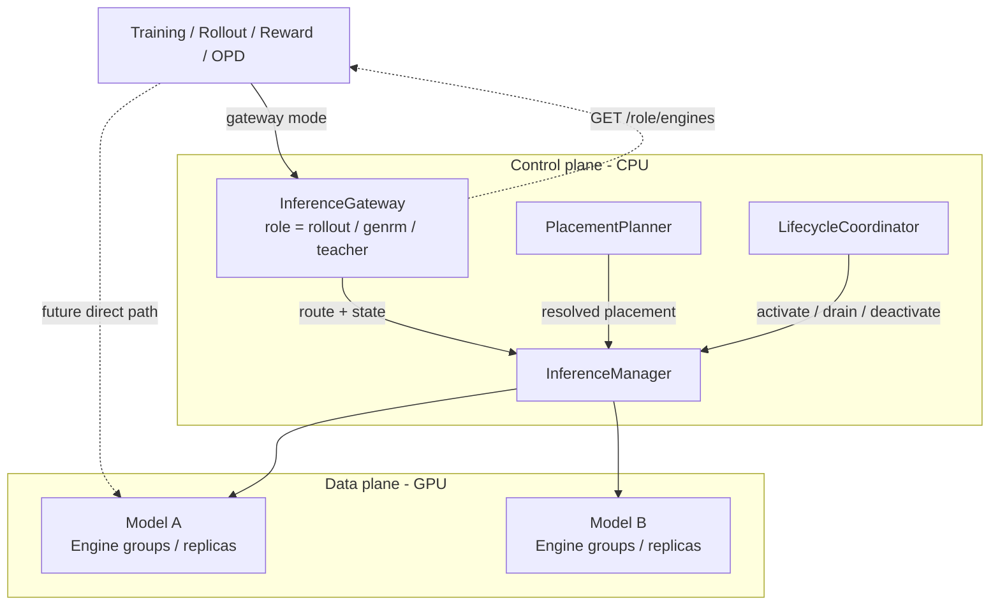
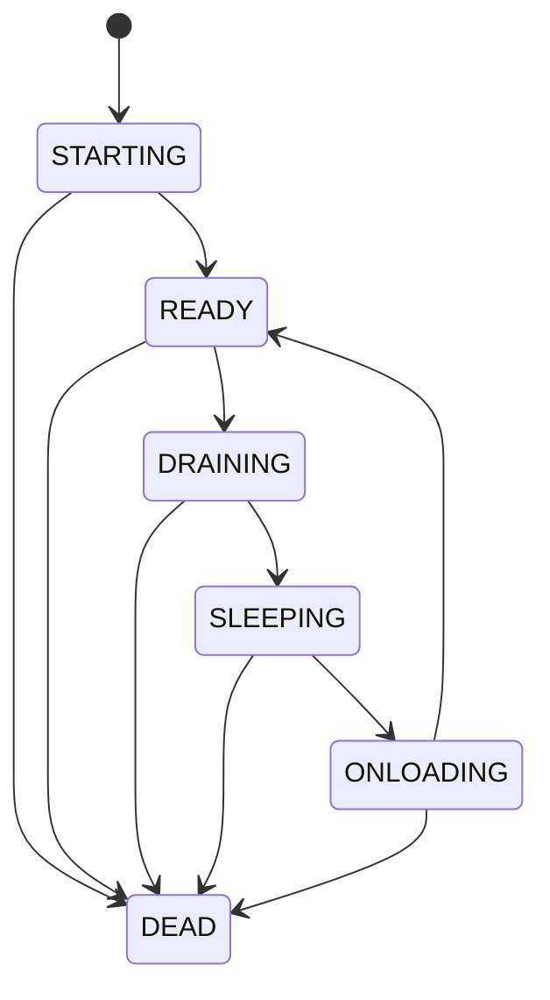
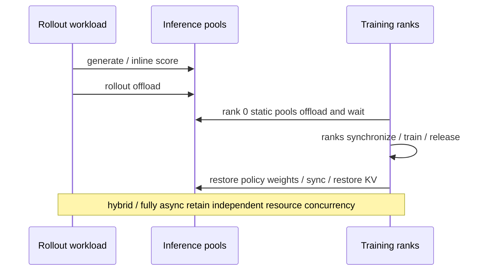

# RFC #71：统一推理服务分期实施待办

按 RFC 的 Phase 0–7 推进。每一期形成可独立评审的改动，完成验收后进入下一期；一期可以拆成多个 PR。

总体目标：统一 Rollout、GenRM、SGLang Teacher 的接口、引擎管理、资源规划与生命周期，并完成 deferred OPD 数据闭环。

我们只负责代码修改，文档更正不在我们的工作范围内。本 todolist 是经确认维护的实施设计；不新增或修改用户文档。

## Phase 0：建立现状基线，确认迁移契约

目标：明确哪些行为需要保留、哪些职责需要迁移。

- [x] 记录三类角色的启动、请求、权重更新、卸载、恢复和关闭调用链。
- [x] 整理 colocate、hybrid、fully async 下的资源布局和调用时序。
- [x] 盘点现有 HTTP 接口、Ray 方法、响应结构及其调用方，包括 Autoscaler、Agentic、奖励函数和 OPD。
- [x] 整理 Model、EngineGroup、跨节点副本与 PG 所有权的现有表达。
- [x] 标出 RolloutManager 中的引擎管理职责与 workload 职责。
- [x] 整理已有测试，补充关键现有行为的特征测试。
- [x] 建立 RFC 未决事项表，并在相关阶段实施前确认：直连回退、外部 discovery 鉴权、defer 阶段顺序、弹性范围、兼容门面退役条件。
- [x] 为参数解析、Controller/Service/Launcher 改动和公开 API 删除设置单独评审节点。

验收：

- 产出三角色对照表、时序图、调用方清单、兼容清单及测试矩阵。
- 不改变运行行为。
- 后续每项迁移都能追溯到现有调用方和验证方式。

## Phase 1：统一 Discovery 与公共客户端

目标：保留现有 managers，先建立公共查询和访问契约。

- [x] 定义公共模型/副本 discovery 类型，包含角色、模型、模型级生命周期状态、准入、访问能力、权重版本和 Manager epoch。
- [x] 为三个现有 managers 增加适配，提供公共拓扑快照。
- [x] 公共 `ReplicaSnapshot` 表示完整逻辑副本，不暴露 `is_entrypoint` 或 `worker_type`；PD worker 细节留在 Manager 内部。
- [x] 接入必要的状态维护，禁止把“actor 存在”直接等同于 READY。
- [x] 在扩缩容、重启、恢复及地址变化后的查询中发布完整快照；缓存一致性使用 `manager_epoch`。
- [x] 实现无副作用的共享路由逻辑：显式 model → route_key 映射 → 默认模型 → 报错。
- [x] 首版路由统一选择 Router；不在内部路由中暴露 direct/access mode 或副本代次。
- [x] 保留旧 /rollout/engines 消费者所需兼容行为；GenRMClient 接入 v2 discovery 查询，其他旧生成路径保持兼容。
- [x] 在公共契约中保留 `allow_defer` 能力；内部路由不把 discovery 快照当作请求准入凭据。

验收：

- 三种角色可通过公共结构描述和查询。
- 模型选择、不可用副本过滤、拓扑刷新、多节点与 PD 行为有测试。
- 原有调用方保持可用；尚未迁移的生成路径继续正常工作。

## Phase 2：统一 CPU Gateway

目标：三种角色共用一个 HTTP Gateway 类，每个角色部署自己的实例。

- [x] 实现 InferenceGateway，承接角色下的 discovery、health、模型列表、原生 generate 和聊天接口。
- [x] Gateway 使用 CPU 资源，不绑定推理 GPU PG。
- [x] 复用 Phase 1 路由逻辑，避免 Gateway 和直连客户端各自维护规则。
- [x] 实现请求代理，保留现有流式响应、错误与连接取消所需行为。
- [x] 保留 GenRM messages 输入及 {"response": ...} 输出适配。
- [x] 保留 Rollout 聊天接口；允许 OPD 使用原始引擎 URL 或 Gateway URL。
- [x] 休眠、排空或未就绪模型拒绝推理请求；返回 503 和重试指引，不自动唤醒。
- [x] 将现有 Rollout/GenRM HTTP 入口接到 Gateway，避免产生重复路由或重复部署；Teacher 直连入口暂保留兼容路径。
- [ ] 在 Controller/Service 启动链路注册并部署每个 role 的 Gateway 实例；Rollout/GenRM 已自动部署，Teacher 需等待 Router/模型注册路径完成后再接入。

验收：

- 同一个 Gateway 类服务三种角色。
- 旧接口兼容、流式代理、多模型路由和不可用状态响应通过测试。
- GPU 引擎卸载或重启时，Gateway 仍能提供查询服务。

## Phase 3：统一 Manager 与 SGLang Engine 路径

目标：抽取公共引擎管理实现，保留旧 managers 的兼容门面。

- [ ] 定义内部 Role/Model/EngineGroup/Replica spec，由现有配置转换，不新增统一用户配置体系。
- [ ] 实现模型注册、路由配置、InferenceManager 引擎池、地址、健康、恢复、显存操作和关闭能力。
- [ ] 明确逻辑副本与节点 actor 的对应关系。
- [ ] 根据 weight source、route mode 等能力配置决定权重同步、DCS 与 Router 行为。
- [ ] 合并 GenRM 专用引擎初始化到公共 SGLangEngine 路径。
- [ ] 静态模型禁止注册 DCS 和参与动态策略权重更新。
- [ ] 迁移 GenRM/Teacher 管理逻辑；Rollout 逐步委托公共实现，暂保留 workload 外壳。
- [ ] 保留现有 Rollout 伸缩、故障恢复和权重同步能力。
- [ ] 建立拓扑发布顺序：初始化、健康检查、必要权重同步、Router 更新完成后，再原子发布快照。

验收：

- 三类引擎池的公共操作进入同一套实现。
- 静态模型隔离、初始化失败、重启和权重未就绪不接流量均有测试。
- 旧 manager 调用方通过兼容门面正常运行。

## Phase 4：统一 PlacementPlanner

目标：启动引擎前完成资源分配和合法性校验。

- [ ] 将分散的 GPU/bundle 偏移计算迁入 Planner。
- [ ] 支持独立 PG 的 decoupled 和共享 Actor PG 的 split。
- [ ] 校验 GPU 容量、模型并行布局、节点边界、bundle 范围及 split 重叠。
- [ ] 表达 defer 的共享资源与互斥阶段，为 Phase 5 提供计划。
- [ ] 首版拒绝同一批 GPU 同一阶段的 shared co-resident 布局。
- [ ] 显式记录 PG 所有权：Manager、Controller 或外部服务。
- [ ] managers 消费解析完成的 placement，不再各自推导偏移。
- [ ] 补齐启动失败、部分副本失败和关闭时的资源回滚。

验收：

- 非法布局在启动 GPU 引擎前失败。
- 有效布局与现有部署方式兼容。
- 测试证明共享/外部 PG 不会被错误删除，创建失败不会遗留自有资源。

## Phase 5：生命周期协调与 Deferred Scoring

### 5A：LifecycleCoordinator 与 GenRM defer

- [ ] 实现统一六态与幂等 activate/drain/deactivate/shutdown；补齐 switch_model、阶段占用与操作查询。
- [ ] Coordinator 根据 placement 和阶段计划控制激活权限，禁止冲突角色同时占用共享 GPU。
- [ ] 定义并实现停止接单、在途请求处理、显存释放、加载与 READY 发布的完整顺序。
- [ ] 纳入权重同步、训练 ranks 同步和分阶段恢复 weights/KV cache 的现有约束。
- [ ] 从 Actor、Rollout 和示例脚本迁移跨角色切换逻辑。
- [ ] 将 GenRM defer 整合到框架阶段，取消示例对命名 actor 的直接依赖。
- [ ] 处理超时、取消、重复操作和阶段失败；失败时不继续激活冲突角色。

验收：

- GenRM defer 无需用户脚本手工控制模型切换。
- 在途请求、重复调用、阶段中断、资源互斥有针对性测试。
- split、hybrid、fully async 不因新增 Coordinator 被错误串行化。

### 5B：Deferred OPD 数据闭环

- [ ] 实现 submit/wait/get/cancel_deferred 与批次发布契约，将 Teacher prefill 移到独立评分阶段。
- [ ] 保存样本标识、Teacher 输入、路由、多模态信息和 token-selection 所需数据。
- [ ] Student 排空卸载后激活 Teacher，完成评分及结果关联。
- [ ] 写回 sampled-token/top-k 等对应训练字段，验证长度、顺序、token 对齐与 mask。
- [ ] 对需要 Student 二次 prefill 的模式，安排明确的后续激活阶段。
- [ ] 默认在评分字段完整后再提交可训练数据；同步调整队列目标、生产完成信号和训练等待条件，避免相互等待。
- [ ] 定义部分失败与重试策略，禁止未完成评分的样本被当作正常完整数据训练。
- [ ] 保留现有即时 OPD 路径。

验收：

- 同一批 GPU 可以串行完成 Student → Teacher → Trainer。
- 固定样本与模型权重，比较即时/延迟评分的训练字段及 OPD 计算结果。
- 覆盖乱序返回、部分失败、多教师路由、多模态和 top-k。
- Teacher 结果写回前，训练不能消费该批数据。

## Phase 6：完成 RolloutWorkload 拆分

目标：Rollout 负责生成业务，统一 Manager 负责引擎。

- [ ] 将生成、评估、数据源、奖励后处理和队列传输归入 RolloutWorkload。
- [ ] 引擎创建、资源所有权、恢复和关闭完全迁入统一 Manager。
- [ ] workload 通过明确接口请求推理和阶段切换，不直接操作 GPU bundles 或私有引擎对象。
- [ ] 迁移训练侧权重同步与 manager 连接点。
- [ ] 检查 Agentic、Autoscaler、评估和 SFT predict 等兼容调用方。

验收：

- Rollout workload 不再拥有 GPU 引擎生命周期。

## Phase 7：清理、文档与最终验收

- [ ] 根据已确认的退役条件，删除旧 managers、GenRM 子类和临时兼容门面。
- [ ] 删除命名 actor 特例、重复配置计算和废弃调用路径。
- [ ] 保留承诺兼容的 HTTP 行为；对破坏性变化提供迁移说明。
- [ ] 更新需求直接涉及的代码示例；中英文用户文档与 API 文档交由对应维护者处理，不纳入本次实现。
- [ ] 对照 RFC acceptance checks 逐项提供代码、测试或验证证据。
- [ ] 完成跨角色、跨模式、多模型、跨节点、PD、恢复及资源清理回归。
- [ ] 提交前运行 pre-commit run --all-files 和相关测试。

验收：

- 最终实现只有一套公共 Gateway、引擎管理和 SGLang 初始化路径。
- 每条 RFC 验收项都有明确结果。
- 多节点 GPU 验证通过；无法执行的场景记录具体硬件缺失原因，不能将 mock 测试视为替代。

## 执行约定

- 本清单是完整路线图；各阶段入口先定稿接口与未决策略，再编码，避免下游依赖未确认契约。
- 暂不包含统一 CLI 重设计、shared co-resident、多批次流水线优化和新增 GenRM/Teacher 弹性能力；后者按 RFC 未决事项另行确认。
- 每期补充对应测试，不将所有验证拖到最后。
- 远程训练验证需提供集群和模型信息后安排；Phase 0 只做设计与特征测试，入口检查完成后进入分期实现，不自动启动训练。
- 完整认领不等于一次提交，也不替代项目对受保护改动的确认流程。

## 实现设计与接口规范

本节是实施目标，不表示全部类型、方法和协议已经实现。Phase 0 已完成设计及特征测试；Phase 1 开始首批公共类型和纯路由实现，完整阶段验收仍待后续适配。

### 1. 已确定决策：defer 禁止直连

- 所有参与 defer 的受管理推理请求必须经过 Gateway，包括 Rollout、Teacher、GenRM 和 Student 二次 prefill。
- `direct_eligible` 是模型级访问能力字段；当前内部路由始终使用 Router，尚未实现 direct 客户端路径。
- Gateway 内部可以访问引擎/Router；诊断地址不代表对客户端开放的推理入口。
- 迁移所有框架内裸引擎调用；defer 外部调用仅使用 Gateway。无法控制准入和排空的外部裸 URL 服务不得加入 defer 共享资源计划。
- `direct_eligible=false` 不等于网络隔离，部署访问边界也要落实。Manager epoch 也不能自动阻止任意裸 HTTP 请求。
- 当前 Gateway 不把 `direct_eligible` 作为 Router 请求条件，也不从 discovery 的 replica 地址选择直连目标；Router 缺失时直接返回 503。
- Managed Teacher 当前仍向 OPD 注入原始 engine URL，作为非 defer/兼容路径；TeacherManager 当前不注册 Router，因此后续阶段必须先完成 Teacher 的 Router/模型注册与准入，再迁移 defer 请求。
- 后续如开放 direct，必须单独定义直连准入和排空协议；当前不由 Phase 1 路由函数处理。
- discovery 是观测快照，不预留资源使用权。

### 2. 组件与状态所有权



图中 Model A/B 的推理进程在 GPU data plane；ModelPool 元数据在 CPU Manager 内。Gateway 按 Manager 准入结果代理到引擎/Router，生成 payload 不必再经 Manager 中转。当前内部请求统一经过 Router，直连路径留待后续单独定义。

| 组件        | 职责                                                                  |
| ----------- | --------------------------------------------------------------------- |
| Gateway     | 每角色一个 CPU HTTP ingress；协议适配、代理、流式响应、申请请求准入   |
| Manager     | 每角色一个 CPU 管理实例；引擎池、状态、准入登记、拓扑快照、恢复和关闭 |
| Planner     | bundle/GPU 分配、节点边界、PG 所有权与冲突校验                        |
| Coordinator | 每训练任务的阶段协调；按 activation group 管理资源使用权              |
| Workload    | 生成、评估、奖励、OPD 字段组装与队列提交；不拥有引擎生命周期          |

- Manager 是模型/副本状态唯一写入者；Gateway 不维护第二套可用状态。
- 每角色只有一个 HTTP ingress；`/rollout` 的推理、评估、步骤控制、权重握手、伸缩路由分别委托，禁止重复注册相同前缀。
- Gateway 不绑定推理 GPU PG，引擎休眠/恢复期间仍提供查询。
- Megatron 内部 actor/ref/teacher 权重 tag 切换继续属于训练后端；Coordinator 通过训练侧适配器协调显存和阶段。

### 3. 类型、资源与标识

| 类型                                           | 内容                                                             |
| ---------------------------------------------- | ---------------------------------------------------------------- |
| RoleSpec / ModelSpec / EngineGroupSpec         | 模型、权重来源、路由、并行配置、采样及模板参数；由现有 args 适配 |
| ResolvedPlacement                              | PG、owner、bundle、节点/GPU 映射、activation group 和阶段        |
| RoleSnapshot / ModelSnapshot / ReplicaSnapshot | 角色阶段、模型状态/准入/访问能力、副本地址与权重版本             |
| OperationResult / PhaseResult                  | 操作标识、完成结果或结构化错误                                   |
| RequestPermit                                  | 请求标识、固定目标、Manager epoch、准入登记标识                  |

- replica_id（HTTP 的 engine_id）标识逻辑副本，不使用可变列表下标代替。
- 不追踪副本 generation；Phase 1 只保证同一权重版本的访问一致性，副本自身重启不作为外部契约。
- manager_epoch 在 Manager 重建后变化，用于区分控制面生命周期，拒绝跨 Manager 生命周期复用的缓存和许可。
- GPU 标识必须包含节点信息或使用 PG bundle 映射，不混淆不同节点的本地 GPU 0。
- 跨节点副本内部保留全部 node actors，公开只提供入口；PD worker 单列诊断，不作为普通完整生成副本。

### 4. HTTP 协议与兼容

| 方法 | 路径                          | 行为                                                           |
| ---- | ----------------------------- | -------------------------------------------------------------- |
| GET  | `/<role>/engines`             | discovery 与生命周期状态                                       |
| GET  | `/<role>/health`              | 分别报告 Gateway 存活与模型可用性，计划休眠不等于 Gateway 死亡 |
| GET  | `/<role>/v1/models`           | OpenAI 风格模型列表                                            |
| POST | `/<role>/generate`            | SGLang 原生请求；GenRM 兼容 messages                           |
| POST | `/<role>/chat/completions`    | 聊天别名                                                       |
| POST | `/<role>/v1/chat/completions` | OpenAI 风格聊天及现有流式行为                                  |

- 首版不新增公开 switch_model/offload HTTP 控制端点，阶段控制使用内部 Ray API。
- 旧 `/rollout/engines` 默认保持旧响应；新客户端明确使用 `?schema_version=2`。Teacher/GenRM 新 discovery 默认 v2，不凭空增加旧格式。
- 新旧响应由同一状态源投影，旧 active 不可直接解释为新 READY。
- 保留旧接口请求、响应及错误行为。GenRM messages 仍返回 `{"response": "..."}`；messages 与原生 text/input_ids 混合请求拒绝，避免适配歧义。

v2 discovery 示例，地址与标识仅为示意：

```json
{
  "schema_version": 2,
  "role": "teacher",
  "manager_epoch": "epoch-identifier",
  "phase": "teacher_score",
  "models": {
    "math-teacher": {
      "state": "sleeping",
      "admission": false,
      "allow_defer": true,
      "direct_eligible": false,
      "router_url": null,
      "engines": [
        {
          "engine_id": "math-teacher/replica-0",
          "base_url": "http://node-a:15000",
          "state": "sleeping",
          "weight_version": "policy-v42"
        }
      ]
    }
  }
}
```

- v2 JSON 将内部 models 元组投影为 model_id 键控对象，replicas 投影为 engines 数组；不存在实例时 engines 为空。`state` 是统一生命周期字段，不再另设 readiness。
- 内部路由始终选择 Router；`direct_eligible` 仅记录模型是否具备未来直连能力，不改变当前路由。
- 快照以 `manager_epoch` 区分 Manager 生命周期；本期不维护 topology revision，也不要求每次查询复用增量版本。
- READY 必须有显存恢复、必要权重同步和健康证据；证据不足使用 `STARTING` 或其他非 READY 状态并禁止接单。
- 模型存在合法可服务路径即可 READY，不要求所有副本健康；模型开始 drain 后关闭模型级准入。

### 5. 路由、公共客户端与错误

- Gateway/客户端共享纯路由模块：显式 model → route_key 映射 → 默认模型 → 400。
- 显式 model 无效或明确 route_key 无映射直接报错，不静默改投默认模型。
- 路由元数据与 SGLang payload 分离，内部字段不透传。
- 当前内部路由始终选择模型 Router；副本地址只作为 discovery 观察结果和外部集成信息，不能绕过 Router 作为请求目标。`direct_eligible` 为模型级能力字段，直连协议留待后续阶段单独定义。
- 公共客户端默认不自动回退 Gateway，不透明重放结果不确定的生成请求；流式响应开始后不自动重试。刷新 discovery 不等于授权重发。
- v2 错误采用 error 对象：code/message，以及适用的 model/state/retryable；旧协议由兼容层保持原行为。
- 无效请求或模型/路由选择返回 400，查询资源不存在返回 404；未就绪返回 503 并附重试指引；上游连接/协议错误返回 502，超时返回 504。合法上游业务错误按协议透传。
- retryable 不保证重放无副作用，上游已接收但结果未知时不能承诺安全重试；普通请求永不自动唤醒模型。

### 6. 注册、模型池与路由配置

模型身份为 `(role, model_id)`，不使用 checkpoint 路径或可变列表下标作为身份。每角色一个 Manager，内部 `models[model_id] -> ModelPool -> EngineGroup -> Replica -> node actors`。ModelPool 是 CPU 内存对象，首版不额外增加 Ray actor。PD worker 单独描述，完整服务路径由 Router 提供。

```text
register_model(spec: ModelSpec, placement: ResolvedPlacement, *, operation_id) -> ModelRegistration
configure_routes(routing: RoleRouting, *, operation_id) -> OperationResult
snapshot(model_names=None) -> RoleSnapshot
```

- 配置适配器读取现有 Rollout ModelConfig/SglangConfig、GenRM resolved instances 和 Teacher/MOPD 配置，保持覆盖关系；首版不改 CLI。
- ModelSpec 含 model_id、model_path、weight_source(policy/checkpoint/external)、engine_groups、模板/采样配置及访问能力；RoleRouting 含 default_model、route_key_to_model 和配置版本。
- 注册只建立定义和资源关系，不启动 GPU 引擎，不授予准入。先注册全部模型，再原子发布路由，禁止悬空映射。
- 首版模型集合在启动时固定，不支持运行时添加、热替换或注销模型；原有 Rollout 副本弹性保留。单实例 GenRM 的默认行为由旧协议适配保留。
- 同 operation_id 同参返回原结果，异参报 conflict；已有 model_id 配置不一致报错，不隐式覆盖。
- 未实例化模型用 `registered=true, replicas=[]` 表达；它没有副本生命周期状态，也不把未创建实例标为 SLEEPING。
- 配置、路由表和快照生命周期分别管理；Phase 1 使用 `manager_epoch`，不引入 topology revision。

### 7. Manager 生命周期与实例状态

```text
activate(model_names, *, operation_id, activation_token, tags=None) -> OperationResult
drain(model_names, *, operation_id, activation_token, timeout_s) -> OperationResult
deactivate(model_names, *, operation_id, activation_token) -> OperationResult
shutdown(*, operation_id, control_token) -> OperationResult
get_operation(operation_id) -> OperationSnapshot
```



- 六态应用于逻辑副本；ModelPool 根据可服务路径汇总模型 `state`。一个副本死亡不意味着整个模型死亡；模型级 drain 关闭该模型全部准入。
- 只有 READY 允许接单。仅恢复 weights 仍为 ONLOADING，完整恢复 KV、必要权重版本、健康和路由条件后才 READY。
- drain 关闭准入并确认在途结束，成功后仍为 DRAINING；deactivate 完成显存释放确认后进入 SLEEPING。超时留在 DRAINING 并记录错误，不交接资源。
- DEAD 是实例终态；重建实例仍从 STARTING 开始，但不向公共契约暴露 generation。主动关闭也需排空与退出确认；未重新初始化的死亡实例不能直接变 READY。
- `release_confirmed` 独立于生命周期，DEAD/异常/actor 不可达都不能推定显存已释放。所有权与释放结果要有各节点/rank 的证据。
- 迁移期间证据不足使用 `STARTING` 或其他非 READY 状态，不能新增 UNKNOWN 到实例六态，也不能冒充 READY。
- activate/recover 必须验证当前资源组激活权限；休眠时只登记恢复需求，不自动重建占用 GPU。
- Manager 是状态唯一写入者。短临界区提交状态，等待 RPC 不占状态锁；操作执行期间 snapshot 和请求完成上报必须可用，回调校验实例/操作代次。

### 8. 请求准入、完成与取消

```text
admit_request(model_id, request_id, *, phase_handle=None) -> RequestPermit
complete_request(permit_id, completion: CompletionEvidence) -> OperationResult
cancel_request(permit_id, *, operation_id) -> OperationSnapshot
get_request(permit_id) -> RequestSnapshot
```

- admit 原子验证模型、阶段和 READY，固定目标并登记请求。permit 绑定 job/session、Manager epoch、模型、endpoint、上游 request ID；Router 目标不伪称知道它最终选择的 worker。
- 同 request_id 在当前 Manager epoch 内重复 admit 返回原登记；异模型/异阶段报冲突。许可幂等不等于推理去重，Gateway 不得因返回同许可而重复发送请求。
- complete 幂等；CompletionEvidence 只接受正常终止响应、已确认中止或已确认目标进程退出。由受信任 Gateway/引擎适配器关联到原请求与实例，不能只传任意 `finished=true`。
- 流式请求覆盖完整上游计算周期；finally 关闭连接不自动清除登记。取消只发起中止，确认终止前维持在途状态。
- Gateway 崩溃、超时、断连、HTTP abort ACK 均不证明完成；不能用 TTL 清空登记并交接 GPU。
- Router permit 可跟踪模型入口请求，不能证明单个 worker 排空。单副本移除需要 Router 停止分流确认和引擎侧请求完成证据。
- 非 defer direct 不经 Gateway，其排空依赖引擎侧停止接单与完成确认；缺能力时受管理的移除返回 unsupported/failed，或按明确中止策略终止进程并确认退出，不能用 sleep 冒充成功。
- 当前本地 InferencePermitManager 保留为 workload 并发限制，不承载跨角色资源所有权，不与生命周期许可混用。

### 9. Coordinator：切换、阶段占用与训练适配

```text
switch_model(activation_group, target: ModelRef, *, operation_id,
             timeout_s) -> SwitchResult
transition(activation_group, target_phase, *, operation_id,
           timeout_s) -> PhaseResult
enter_phase(plan_id, phase_id, *, operation_id, timeout_s) -> PhaseHandle
finish_phase(handle, *, operation_id, outcome, timeout_s) -> PhaseResult
get_operation(operation_id) -> OperationSnapshot
get_activation_group(activation_group) -> ActivationGroupSnapshot
```

- switch_model 是单目标资源切换入口，与 transition/enter_phase 共用执行器；Coordinator 查询当前占用者，不相信调用方缓存的 source_model。切换不修改默认模型/route_key。
- enter_phase 从固定、版本化 PhasePlan 解析完整目标集合，多教师一起激活，不逐个 switch 互相卸载。首版一次阶段仅涉及一个 activation group，跨组联合事务不支持；独立组可并行。
- switch/transition 成功后目标占用持续有效直到下一次合法切换；enter_phase 额外建立操作级独占句柄，期间拒绝其他冲突切换。
- finish_phase 明确关闭该阶段准入、排空、停用并确认释放后才解除独占；不自动恢复上一模型，不自动选择下一阶段。重复 finish 返回原结果。
- PhaseHandle/activation_token 绑定 job/session、Coordinator epoch、activation_group、operation_id、目标集合。共享资源所有变更验证权限，不能仅凭任意 operation_id 修改状态。
- 同组相同操作复用结果/等待，异操作首版返回 busy，不隐式排队过期意图。
- 已是目标且完整 READY 时切换为空操作；仅部分恢复不满足此条件。等待超时不撤销后台操作，不自动释放占用；通过查询接口确定结果。

```text
Close admission -> Drain -> Deactivate -> Confirm release
-> Grant next activation -> Activate -> Publish READY / phase completion
```

训练侧使用内部适配器，签名在接入后端时细化，但现在固定其完成语义：

```text
prepare_training_handoff(batch_id, policy_version, *, operation_id, activation_token) -> HandoffResult
release_training_resources(*, operation_id, activation_token) -> ReleaseEvidence
```

- release 必须确认所有相关训练 ranks，保留原 weights/KV 分段恢复与权重同步顺序，不能只看 rank 0。
- prepare_training_handoff 返回时已允许 Trainer 接管并等待/消费该批数据，不以“已收到完整训练数据”为前提；避免与 Deferred 发布互等。
- 排空、释放或目标加载失败不自动回滚激活旧角色；返回最后确认阶段和 release_confirmed，未确认释放时禁止下一角色激活。

### 10. Deferred 操作与数据发布

DeferredExecutor 属于 Workload 的内部执行组件，不增加图外独立控制服务；Coordinator 管阶段，Manager 管模型，Executor 管样本与队列。

```text
submit_deferred(batch_ref: BatchRef, plan_id, *, operation_id) -> DeferredHandle
wait_deferred(handle, *, timeout_s=None) -> DeferredResult
get_deferred(operation_id) -> DeferredSnapshot
cancel_deferred(operation_id) -> DeferredSnapshot
```

- DeferredPlan 由现有配置适配，包含 activation_group、计划版本、评分阶段与目标集合、scorer kind、输入/输出字段、训练交接及失败策略。首版不提供通用工作流 DSL。
- BatchRef 在提交时封存并保持有效直到终态，至少包含 batch_id、sample_id、policy_version、生成 tokens/response_length/mask、多模态数据、Teacher 输入、固定模型路由及其版本、token-selection/top-k 信息。
- 首版以完整批次为单位，批内并发，禁止跨批次流水线。支持 GenRM、Teacher prefill、可选 Student 二次 prefill；后者必须保持要求的策略版本。
- submit 只确认暂存登记，不代表可训练。结果按 sample_id 关联，检查重复/缺失、长度、token 对齐、mask 和全部必需评分字段。
- 首版不自动重放结果未知的评分请求，不自动发布部分成功批次。确认失败使批次失败，成功样本记录保留用于诊断；扩展重试策略另审。
- wait 超时只终止本次等待。cancel 关闭后续评分请求，等待已发送请求中止/结束和资源释放；取消未确认保持 cancel_pending。
- 相同 operation_id 绑定相同 batch/计划/路由/策略版本，不重复评分或发布；不同输入报 conflict。

固定执行次序：

```text
SEALED/STAGED -> WAITING_PHASE -> SCORING -> VALIDATING
-> GPU_RELEASE_CONFIRMED -> TRAIN_HANDOFF_GRANTED
-> PUBLISHING -> PRODUCTION_COMPLETE -> COMPLETED
```

发布接口边界（在 Workload/现有队列适配器内部实现）：

```text
publish_validated_batch(batch_ref, *, publish_id, handoff) -> PublishResult
get_publication(publish_id) -> PublicationSnapshot
```

- 暂存批次不计入可训练样本/队列目标；发布前整批评分校验完成且冲突推理资源释放，Trainer 已获接管权限。
- 队列容量不足整批时允许逐块发布并同时消费，生产完成标记最后提交；不能等整批入队后才允许 Trainer 消费。
- 在首个可训练写入前进入不可撤销发布阶段；此后 cancel 返回不可撤销/发布中或已完成，不能声称已消费数据被取消。
- publish_id 唯一绑定批次版本；适配器记录块确认和最终完成标记。写入结果不明时不得盲目重发；若队列无去重/查询能力，则失败关闭并要求任务级重启，不承诺跨崩溃 exactly-once。
- wait 成功要求所有发布块和生产完成标记已确认；评分缺失不能用空字段替代。即时 OPD 路径继续保留。

### 11. Placement、恢复、伸缩与权重同步接口边界

```text
adapt_existing_args(args) -> RoleSpecs + RoleRouting + PhasePlans
PlacementPlanner.plan(role_specs, resource_inputs, phase_plans) -> PlacementPlan
materialize_placement(plan, *, operation_id) -> ResolvedPlacement
release_owned_placement(placement_id, *, operation_id, release_evidence) -> OperationResult
recover(model_names, *, operation_id, activation_token) -> OperationResult
```

- Planner 只解析/验证，无 GPU 进程副作用。PlacementPlan 含 plan_id/version、创建者/owner、共享关系、bundle/node/GPU 映射约束和阶段冲突；实际节点/GPU 映射在 materialize 后解析。
- materialize 由指定资源所有者执行，创建成功立即记入资源账本；共享/外部 PG 仅借用。失败回滚本次创建的资源，不删他人 PG。关闭全部 node actors 并确认退出后再释放 PG。
- 多节点逻辑副本保留所有 actors，公开入口只含 head；Teacher 当前单节点副本实现的限制不能借统一类型宣称消失。
- Phase 3 复用/提取 MultiEngineManager 的现有能力，采用组合；旧 managers 为门面，迁移中同一状态只能有一个写入者。
- 首版不新增 GenRM/Teacher 弹性 API。Rollout 继续保留现有 create/execute/get/list/cancel scale-out、create/execute/get/list scale-in、get_rollout_engines_and_lock 五元组及权重握手，逐项委托，不提前删除公开方法。
- 动态权重模型：引擎健康 → 按模式建立 DCS 或 seed 同步通道 → 同步并确认目标权重版本 → Router 注册并验证 → READY。DCS 建通道不代表可接流量；静态模型不注册策略 DCS。
- 移除：关闭准入/Router 分流 → 确认在途结束且无并行权重更新 → 注销 DCS → 关闭所有节点 → 释放自有资源。权重更新锁与拓扑变更的串行关系必须保留。
- 非 defer direct 的主动生命周期操作受第 8 节约束；当前遗留路径先特征化，不能把固定等待升级成安全保证。

### 12. 操作、控制面失效与外部访问边界

所有异步操作用共同 OperationSnapshot：`operation_id, owner_epoch, status, last_confirmed_step, error, release_confirmed`；状态为 running/completed/failed/cancel_pending/cancelled。错误 code 至少覆盖 invalid_argument/not_found/conflict/busy/stale_generation/unavailable/unsupported/timeout/unknown_completion。HTTP 映射保留第 5 节规则，内部控制接口不新增公开 HTTP 路径。

- operation_id 在当前 job/session、服务 epoch 和操作记录中保持幂等，比较归一化参数；任务存活期间不提前丢弃有副作用操作的去重记录。
- 首版不支持 Manager/Coordinator/DeferredExecutor 丢失内存后的透明恢复；不引入持久操作日志或跨重启 exactly-once。
- Manager/Coordinator 失效触发任务失败关闭：停止自动激活，Gateway 无有效控制面时拒绝新请求；新 epoch 拒绝旧 permit/token/handle。不能仅生成新 epoch 后复用 GPU，任务清理必须先确认旧 actors/子进程退出再重启。
- 未失去状态的引擎副本恢复属于 recover；与控制面重建不同。Gateway 失效但 Manager 存活时，未确认请求继续阻塞交接。
- discovery 首版限定受信任任务网络，不增加公开外网暴露或新的鉴权系统；未来外部 discovery 鉴权和部署访问边界单独评审。defer 准入上线前必须验证无法绕过 Gateway。
- 兼容门面退役条件：内部调用全部迁移、旧 HTTP 承诺仍满足、外部消费者迁移方案已确认、各模式回归具备证据；Phase 7 删除前单独确认。

### 13. Phase 0 当前基点盘点与验证矩阵

基点：`2a8d2ed9e517477bd50aa5bff4077b229f4815fb`。本表只记录已读源码和测试定位；设计目标不代表当前运行能力。

| 角色    | 启动/请求                                                                                                                              | 生命周期/权重/关闭                                                                                                   |
| ------- | -------------------------------------------------------------------------------------------------------------------------------------- | -------------------------------------------------------------------------------------------------------------------- |
| Rollout | Controller → Service → create_rollout_manager → RolloutManager/EngineGroup → SGLangEngine；workload/Agentic 访问 Router                | 动态策略 DCS/seed 同步；offload/onload weights/KV；健康恢复、伸缩；Controller → dispose → 节点 shutdown              |
| GenRM   | create_genrm_managers → 每实例 GenRMManager → MultiEngineManager/GenRMEngine；HTTP messages/route_key → template/input_ids → head 地址 | 静态权重；继承共享 manager 恢复/清理；引擎 pause/abort/flush/release；完整 resume 才 continue；命名 manager 兼容保留 |
| Teacher | opd_utils 工厂 → TeacherManager/MultiEngineManager → SGLangEngine；启动时注入 `/generate` URLs                                         | 静态模型跳过 Router/DCS；共享 PG 恢复复用 endpoint，独立 PG 死亡需全局重启以刷新 URL；shutdown 按 owns_pg 清理       |

| 模式/对象            | 当前资源和时序                                                                                                           | 迁移注意                                                                |
| -------------------- | ------------------------------------------------------------------------------------------------------------------------ | ----------------------------------------------------------------------- |
| 同步 colocate        | Actor PG 共享，Rollout 在前；split 静态池在后；生成结束卸载推理，训练 ranks 同步后恢复训练                               | 保留所有 ranks 确认、weights/KV 两段恢复；不能只看 rank 0               |
| GenRM defer          | 特例从 Rollout 区域复用 bundles；示例私有 offload → named GenRM onload → score → offload                                 | 迁入 Coordinator + DeferredExecutor，示例不再自行切换                   |
| hybrid / fully async | Controller 区分共享 PG 分支；服务独立资源；同步/hybrid 与纯 async 权重链路不同                                           | 独立 activation groups 保持并行，不能按同步 colocate 全局串行化         |
| 模型/副本            | Rollout ModelConfig → server → groups；GenRM/Teacher 共用 MultiEngineManager；all_engines 为 node slots，engines 取 head | 旧 discovery 的 total/active 不是逻辑副本数/READY；跨节点与 PD 必须过滤 |
| 所有权               | Service 共享 PG 标记、MultiEngineManager per-slot owns_pg、Rollout groups 分散管理                                       | Planner 统一归属，部分失败立即回滚；不能把分数 GPU 当实际资源隔离       |

同步 colocate 的现有交接链（可选角色仅在启用时参与）：



GenRM defer 示例在后处理内执行 Rollout offload → named GenRM onload → score → GenRM offload；纯 async 经生产/评估就绪握手 → DCS 权重更新 → end_update_weight 恢复生成，不套用上图的全角色串行顺序。

| Characterize 范围 | 现有与新增验证文件（相对 tests/）                                                                                                                                | 必须保留的边界                                                               |
| ----------------- | ---------------------------------------------------------------------------------------------------------------------------------------------------------------- | ---------------------------------------------------------------------------- |
| args              | utils/test_arguments_genrm_instances.py、test_arguments_opd_teacher_colocate.py                                                                                  | legacy/多实例优先级、空 overrides、resource GPU budget、colocate 条件        |
| placement         | distributed/ray/test_teacher_manager.py、test_opd_multi_teacher_orchestration.py、test_multi_engine_manager.py                                                   | bundle 偏移前缀和、共享/独立 owner、不删除借用 PG                            |
| endpoints         | components/test_genrm_engine_pick.py、utils/test_genrm_client_contract.py、distributed/ray/test_coordination.py、engine/rollout/test_teacher_routing_contract.py | messages/route_key/response strip、缓存刷新、旧 discovery、未知路由、旧重试  |
| lifecycle         | distributed/ray/test_multi_engine_manager.py、backends/sglang/test_genrm_offload_drain.py                                                                        | 休眠窗口死亡恢复、新建实例不重复 resume、完整/部分恢复、drain 超时           |
| DCS/router        | backends/sglang/test_router_registration.py、distributed/ray/test_teacher_manager.py                                                                             | head+async DCS 注册、静态隔离、启动先于注册、PD bootstrap、external 不杀进程 |
| OPD               | engine/rollout/test_on_policy_distillation_payload.py、test_on_policy_distillation_teacher_failures.py                                                           | sampled/top-k/失败字段；后续另加延迟等价与发布测试                           |

调用方兼容清单：

- Autoscaler 消费旧 `/rollout/engines` 和 scale 请求状态；Phase 1/3 保留投影与弹性协议。
- Rollout HTTP 的步骤、eval/predict、权重握手、scale 路由继续委托 workload/旧门面，只有一个 `/rollout` ingress；聊天流式与错误保持旧协议。
- GenRMClient、dapo_genrm、defer 示例消费 messages/route_key 与 response；旧客户端和服务端已有重试，公共客户端不透明重放策略不能静默覆盖旧协议。
- GenRM `/generate` 继续由旧 GenRM Service 处理 messages、chat template、`input_ids` 和 `{"response": ...}` 适配；Gateway 不将其直接改发为原生 Router payload。
- 原生生成和 Agentic backend 直访 Router；Teacher prefill 与 Student 二次 prefill 直访 URL；defer 全部迁入 Gateway。Agentic session abort 与 rollout abort_all 要关联到新的请求登记。
- 训练侧消费 engine/lock/new count/GPU counts/offsets 五元组、DCS 和 weights/KV 操作；Phase 3/6 通过门面保持。
- RolloutManager 的 servers/groups、地址、健康、伸缩、权重锁、恢复、显存和关闭归 Manager；generate/eval/predict、数据源、奖励、OPD、样本组装和队列归 Workload。

请求完成核实：本机 SGLang 0.5.12.post1 的原生 rid、abort_request 与 tokenizer 实现已读；abort ACK 仅证明发送给 scheduler，没有持久按 rid 查询完成的公共契约证据。当前仓库引擎适配又增加了 GenRM drain 和 Router removal 确认，仍不能据此证明所有入口请求结束。目标镜像/远程实际版本需在对应阶段重新核验；缺能力时拒绝交接。

### 14. 实施入口检查与评审节点

- 当前必须定义的接口已列出：配置适配、注册/路由、Planner/materialize/rollback、生命周期、请求准入/完成/取消、模型切换、阶段占用、训练交接、Deferred 操作、发布与操作查询。
- Phase 1 先实现无 Ray 副作用的公共类型和纯路由，再接三类 manager 快照适配及公共客户端；使用可验证的旧状态证据，不默认 READY。
- 后续能力待实现验证，不作为缺失设计接口：引擎 abort 完成证据、Router/PD 版本适配、多节点释放、OPD 数值等价、队列发布确认。
- 首版明确排除：运行中新增/替换模型、GenRM/Teacher 新增弹性、跨批流水线、跨组联合事务、控制面透明恢复、公开 HTTP 生命周期控制。
- 参数解析、Controller/Service/Launcher、新依赖、公开 API 删除/重命名仍为独立评审点，实施前提交具体差异并确认；Phase 0/首批纯类型与路由不触及这些受保护修改。
- 多节点 GPU 集成测试未运行：未提供目标 Ray 集群、模型目录及多节点硬件信息；本期不启动训练，CPU mock 结果不能替代硬件验收。
- Phase 0 新基点回归：149 passed，覆盖第 13 节五类契约及 OPD；Phase 1 纯类型/路由回归为 30 passed。CPU mock 未启动 Ray 集群或 GPU 引擎。

### 15. 执行记录

- Phase 0：当前必须定义的接口已闭合，五类 characterization 与既有 OPD 回归通过；结束本期，开始 Phase 1。
- Phase 1 首批文件：`relax/engine/inference/types.py`、`routing.py`；标准库数据类型与纯选择逻辑，无 Ray/HTTP/GPU 副作用。
- 已实现：角色/模型/副本 discovery 类型、模型级 `state`/`admission`/`direct_eligible`、`allow_defer`、Router 地址、权重版本和 `manager_epoch`；显式模型/路由键/默认模型选择；Router-only 纯路由；v2 JSON 序列化和旧 `/engines` 结构投影；Router 缺失、模型未就绪和准入关闭错误。
- 已确认的简化：删除 `generation`、`is_entrypoint`、`RouteTarget.engine_id`、`RouteTarget.via_router` 和公共 `ReplicaSnapshot.worker_type`；副本只保留资源标识、地址和权重版本，访问策略归模型层级。
- 已确认的字段语义：`RoleSnapshot.phase` 仅表示角色 Manager 自身阶段；`manager_epoch` 表示一次 Manager/control-plane 生命周期；`direct_eligible` 与 `allow_defer` 是模型能力，不是请求准入；请求准入仍由 Manager/Gateway 负责。
- 兼容查询补充：旧 `/engines` 查询支持 `status_filter=active|dead`；公共 legacy JSON 不再输出恒定的 `worker_type`，Manager 内部 PD worker 类型仍保留。
- PD prefill/decode worker 仍由现有 Manager/EngineGroup 内部结构描述，未映射到公共 `ReplicaSnapshot`。
- 已实现：三个 manager 的快照适配、状态/epoch 发布、公共 HTTP discovery 客户端和 GenRMClient 查询接入；纯路由 candidate 仍不作为准入许可。
- Phase 2 当前边界：Rollout/GenRM 的公开 ingress 由 CPU Gateway 接管，原服务位于 `/{role}/backend`；SGLang Rollout discovery 明确发布模型级 `allow_defer=true`、`direct_eligible=false`，Rollout Gateway 推理路径只使用 Router，`direct_eligible` 不参与 Router 选择，Rollout backend 拒绝无 Gateway 标记的推理直连。GenRM 生成仍经旧 Service 适配并允许 backend fallback；Teacher 暂保留原始 engine URL，尚未具备可用的 defer Gateway。
- 后续阶段必须补齐：Teacher Router 注册与 model-level readiness/准入、OPD defer 请求迁移、GenRM 公共 Manager 的协议适配，以及不混淆节点 actor、逻辑副本、权重版本和 Router 健康证据的拓扑快照。
- 本次检查结果：最新受影响回归测试 `71 passed`，覆盖 Gateway、Rollout 直连拒绝、discovery、Router 注册、TeacherManager 和 OPD 编排；受影响文件 pre-commit 已通过；本期未启动 Ray/GPU 服务。
